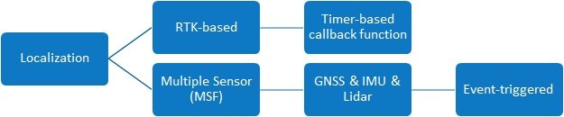
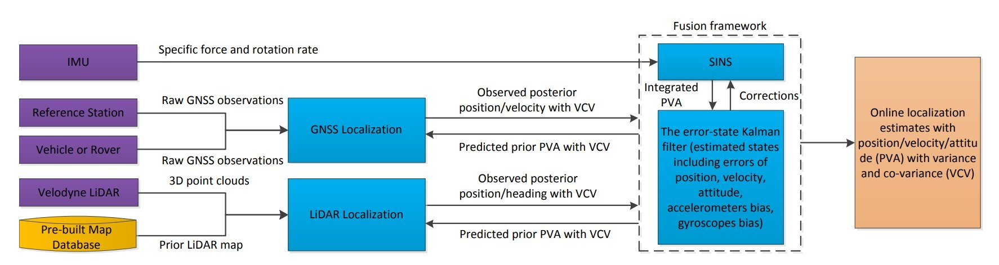

**Localization**

在这个模块里，Apollo提供了两种定位模式

1. RTK-based，即 GNSS+IMU的传统定位方式。 该模式属于 timer-triggered, 该模式下的定位应该会被周期性的调用。
2. 多传感器融合 (Multi-sensor Fusion Localization)，即 GNSS, IMU 和 Lidar 三者配合使用，完成定位。如下图所示，大体原理应该是这样的：首先比对 **Lidar 采集的点云**和**事先建好的地图**，得到 Lidar 的定位结果。之后 Lidar 定位 ，GNSS 定位，IMU 三者用卡尔曼滤波做融合。实现的具体原理参见这篇论文 [[1711.05805\] Robust and Precise Vehicle Localization based on Multi-sensor Fusion in Diverse City Scenes](http://link.zhihu.com/?target=https%3A//arxiv.org/abs/1711.05805)。

Robust and Precise Vehicle Localization based on Multi-sensor Fusionin Diverse City Scenes