### apollo相对地图

​	相对地图是Apollo2.5引入的新特性。从架构层面，相对地图模块是连接高精地图(HD Map)、感知(Perception)模块和规划(Planning)模块的中间层。相对地图模块会实时生成基于车身坐标系的地图（格式与高精地图一致），其原点位于车辆本身，并且输出供规划模块使用的参考线。基于相对地图的导航模式，让开发者可以不依赖高精地图便可实施测试道路的实车调试，

​	导航模式的基本思路是:**通过人工驾驶方式录制测试道路上的行驶轨迹**；

​	利用Apollo工具对原始轨迹进行处理得到平滑轨迹，该轨迹既用于替代路由(Routing)模块输出的导航路径，也是规划(Planning)模块用到的参考线（或称指引线、中心线，Reference line），还是生成相对地图（Relative Map）的基准线。此外，平滑轨迹还可用于替换高精地图内某些车道的参考线（默认情况下，高精地图将车道中心线作为参考线，在道路临时施工等特殊情形下该方式很不合适，需使用人工录制并平滑处理的轨迹替换特殊路段的车道参考线）；

​	自动驾驶过程中，感知（Perception）模块的相机（Camera）动态检测道路边界及障碍物，地图（Map）模块下的相对地图（Relative Map）子模块基于参考线及道路边界实时地生成相对地图（使用以车辆当前位置为原点的相对坐标系），规划（Planning）模块依据地图模块输出的相对地图和感知模块输出的障碍物信息，动态输出局部行驶路径给控制(Control)模块执行。目前，导航模式仅支持单车道行驶，可完成加减速、跟车、遇障碍物减速停车或在车道宽度允许的情形下对障碍物绕行等功能，后续版本的导航模式将会进一步完善以支持多车道行驶、交通标志和红绿灯检测等。

​	在相对地图中，车道线数据是通过基于摄像头的车道感知而生成的，并且包含基于云端的导航线（NavigationLine）。相对地图实时基于摄像头生成，生成范围距离是一个可调参数。我们目前设置的是300米，当摄像头看不到300米时，我们会根据可见数据进行预测补足至300米。

#### 相对地图的优点？


#### 导航线

​	导航线在自动驾驶中扮演着多种角色。第一，导航线作为出发点与目的地点的连接线，提供车道级别导航；第二，导航线可以生成Referenceline用于驾驶决策；第三，为高精地图提供载体；第四，导航线是相对地图的重要组成部分。

导航线有以下特点：

1．导航线是按照驾驶员驾驶路径设计，所以安全性和舒适性是有保障的；

2．更重要的是，基于驾驶数据，导航线可以自动生成，大大降低了开发成本；

3．可以与视觉感知系统配合生成基本的地图信息，可以适用于比较简单的驾驶场景，比如高速公路、乡村道路等；

4．导航线可以与高精地图结合，生成复杂的驾驶场景，例如城市道路。

#### 相对地图和SLAM的区别

​	其实SLAM问题可以描述为：汽车在未知环境中从一个未知位置开始移动，在移动过程中根据位置估计和地图进行自身定位，同时在自身定位的基础上建造增量式地图，实现汽车的自主定位和导航。

​	RelativeMap在基于指引线录制模式时，会依赖录制的指引线与实时摄像头信息生成RelativeMap，同时，依靠GPS定位；在基于纯摄像头模式时，并不进行自身定位和建造增量式地图，只依赖实时摄像头生成的车道线信息行驶

#### 工作流程：

1、在实现真正的自动驾驶之前，我们需要采集导航线，经过对驾驶员驾驶路径的采集，后期可以转换成为（如下图绿色线条）

2、请求云端传统导航地图（百度地图or谷歌地图），生成A到B点的轨迹（蓝色线条）

3、在接到导航需求时，系统会选择一条最匹配的导航线（黄色标线）用来导航；

4、系统为决策模块提供多条导航线，可以实现变道功能

### 应对场景

​	在行驶过程中，相对地图数据的计算和更新频率10Hz，相对地图数据来源一是基于视觉感知的车道标识，二是基于云端的导航线，而且相对地图支持以下三种自动驾驶场景：

##### 相对地图模式1，仅依靠视觉感知的车道标识（纯摄像头）

适用场景：

1、定位缺失；

2、只有来自感知系统的车道线识别；

3、车道保持与自适应巡航。

当GPS失效时（比如通过某个隧道），系统将自动切换为基于纯摄像头模式，此时只依赖实时摄像头生成的车道线信息行驶。只要有车线可以辨别，车会沿着车道中心线一直开（LaneKeeping）。如果车道线不可辨别，需要人来接管

##### 相对地图模式2，依靠视觉感知与云端导航线（纯摄像头+GPS）

适用场景：

1、感知系统检测的车道标识

2、能从云端获取导航线

3、高速道路或者车道线不清晰的乡村道路

此条件下，导航线与感知系统结合生成地图数据，用于车辆决策。

##### 相对地图模式3，依靠视觉感知、云端导航线以及高精地图

适用场景：

1、车道标识不是来自于感知系统检测，而是基于历史驾驶数据以及高精地图生成；

2、能从云端获取导航线

3、城市道路

此条件下，导航线结合高精地图，能实现城市道路的规划决策。

### 参考线采集及制作

Apollo 2.5版的构建

首先从GitHub网站【https://github.com/ApolloAuto/apollo】下载Apollo2.5版源代码，可以使用git命令下载，也可以直接通过网页下载压缩包。源代码下载完成并放置到合适的目录后，可以使用两种方法构建：1.在Visual Studio Code中构建（推荐）；2.使用命令行构建。

当然，两种方法都有一个前提，就是在你的机器上已经顺利安装了Docker。Apollo之前版本提供了一个install_docker.sh脚本文件，因为很多开发者反映可能出错，Apollo项目组已将该文件移除。现在要安装Docker就只能参考Docker官方网站的帮助文档了。

1.1在Visual Studio Code中构建

打开Visual Studio Code，执行菜单命令文件->打开文件夹，在弹出的对话框中，选择Apollo项目源文件夹，点击“确定”，如下图所示：

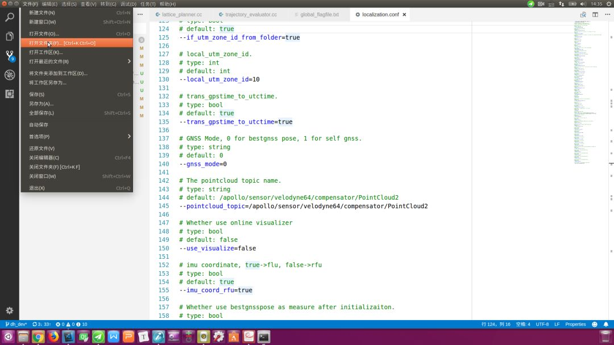

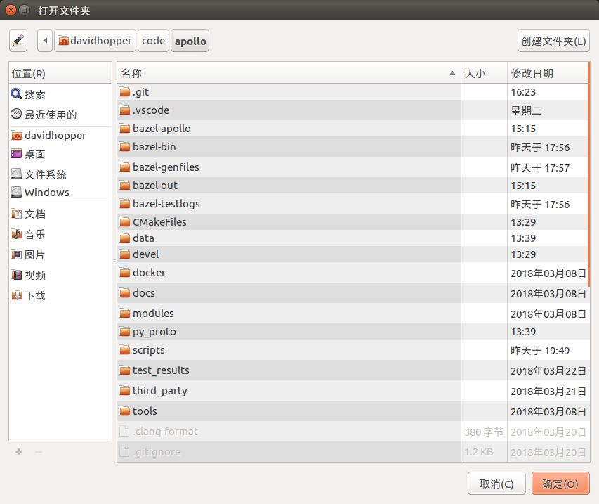

之后，执行菜单命令任务->运行生成任务或直接按快捷键Ctrl+Shift+B（与Visual Studio和QT的快捷键一致）构建工程，若之前没有启动过Docker，则编译时会启动Docker，需在底部终端窗口输入超级用户密码。命令执行完毕，若在底部提示 构建成功 的信息（如下图所示），则表示构建成功。整个过程一定要保持网络畅通，否则无法下载依赖包。构建过程可能会遇到一些问题，解决方法可直接查看GitHub网站的帮助文档.

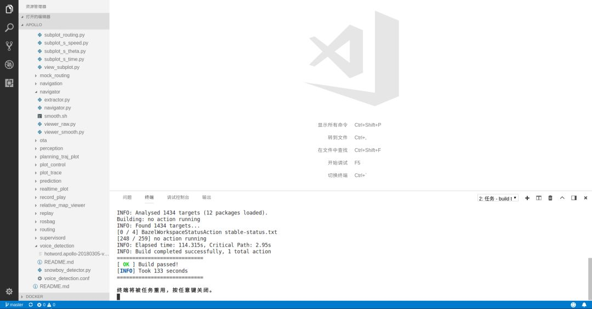

1.2在命令行中构建


```bash
# 按快捷键Ctrl + Alt + T打开命令行终端，输入如下命令启动Docker：
cd your_apollo_project_root_dir# 从中国大陆访问，最好加上“-C”选项，直接访问中国大陆镜像服务器以获取更快的下载速度
bash docker/scripts/dev_start.sh -C

# 输入如下命令进入Docker：
bash docker/scripts/dev_into.sh

#在Docker内部，执行如下命令构建Apollo项目：
bash apollo.sh build

```

整个操作如下图所示：

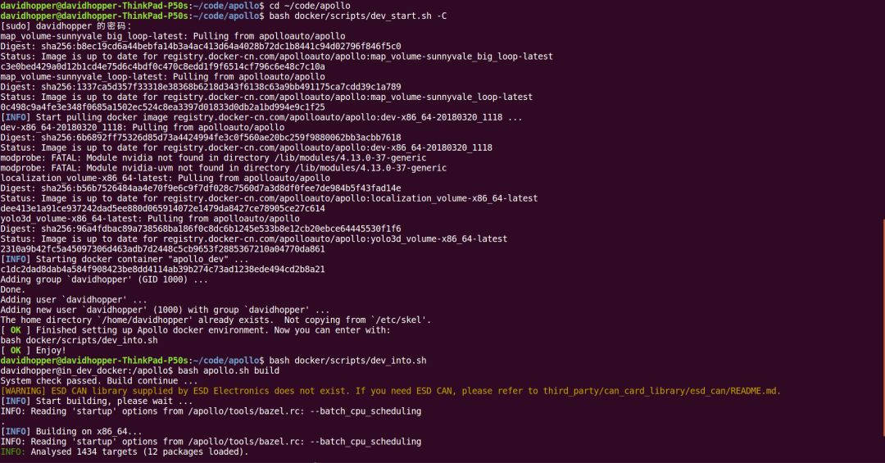

1.3修改定位模块UTM区域ID

Apollo项目定位(Localization)模块默认使用美国西部UTM坐标，在国内需要修改该值。在Docker外部，使用vi或其他文本编辑器，打开文件[apollo项目根目录]/modules/localization/conf/localization.conf，将下述内容：

| 1    | --local_utm_zone_id=10 |
| ---- | ---------------------- |
|      |                        |

 

修改为下述内容（这是长沙地区的UTM区域ID，中国UTM分区可参考该网页【http://www.360doc.com/content/14/0729/10/3046928_397828751.shtml】）：

| 1    | --local_utm_zone_id=49 |
| ---- | ---------------------- |
|      |                        |

 

**注意：如果录制数据时未修改上述内容，则线下模拟测试回放数据包时只能将错就错，千万不能再修改该值，否则地图上的参考线定位会出错！有一次我采集数据时，忘了修改该值，回放数据时又进行修改，结果导致参考线定位到了美国西海岸！我取消修改，按F5键刷新浏览器后显示就恢复正常了。

{  二  }

参考线原始数据的采集

将构建好的Apollo项目文件导入车内工控机，并按照步骤1.2的方法进入Docker，再执行如下命令，启动Dreamview服务端程序：

| 1    | bash scripts/bootstrap.sh |
| ---- | ------------------------- |
|      |                           |

 

在浏览器中打开网页http://localhost:8888（注意不要使用代理），进入Dreamview界面，如下图所示：

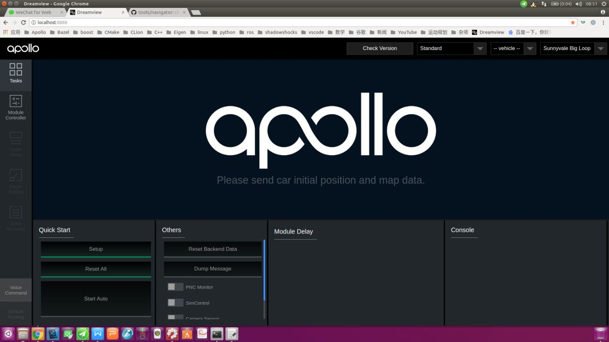

1、驾驶员将车辆驶入待测试路段起点；

2、操作员点击Dreamview界面左侧工具栏中的Module Controller按钮，进入模块控制页面，选中GPS、Localization、Record Bag选项，**注意：如果采集的数据包需用于线下模拟测试，还需加上CAN Bus选项。

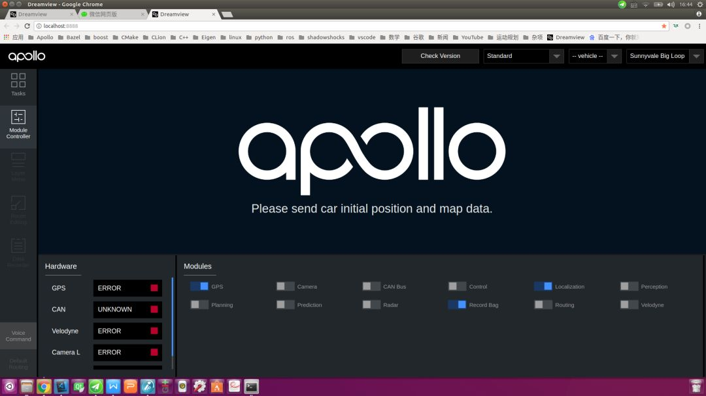

3、驾驶员从起点启动车辆并按预定路线行驶至终点；

4、操作员关闭Dreamview界面中的Record Bag选项，此时会在/apollo/data/bag目录（这是Docker中的目录，宿主机上对应的目录为[你的apollo根目录]/data/bag）中生成一个类似于2018-04-01-09-58-00的目录，该目录中保存着类似于2018-04-01-09-58-00.bag的数据包。这就是我们所需的数据包，请记住它的路径及名称。**注意：单个数据包文件的默认录制时长为1分钟，默认文件大小为2048MB，可通过修改文件/apollo/scripts/record_bag.sh来改变默认值。

为后文阐述方便起见，我假设数据包2018-04-01-09-58-00.bag直接存放于/apollo/data/bag目录。

{  三  }

参考线的制作

参考线的制作既可在车内工控机内完成，也可在其他计算机上实施。无论在哪台计算机上制作，我们首先假定已按步骤1.2的方法进入Docker，并按照步骤二中录制的数据包放置在/apollo/data/bag目录中，且假定该文件名为2018-04-01-09-58-00.bag（在你的机器上并非如此，这样做只是为了后文阐述方便而已）。

3.1从原始数据包提取裸数据

在Docker内部，使用如下命令从原始数据包提取裸数据：

| 12   | cd /apollo/modules/tools/navigatorpython extractor.py /apollo/data/bag/2018-04-01-09-58-00.bag |
| ---- | ------------------------------------------------------------ |
|      |                                                              |

 

上述命令会在当前目录（易知我们在/apollo/modules/tools/navigator目录中）生成一个提取后的裸数据文件：path_2018-04-01-09-58-00.bag.txt。

为了验证裸数据的正确性，可以使用如下命令查看：

| 1    | python viewer_raw.py ./path_2018-04-01-09-58-00.bag.txt |
| ---- | ------------------------------------------------------- |
|      |                                                         |

 

会显示类似下图的路径图：

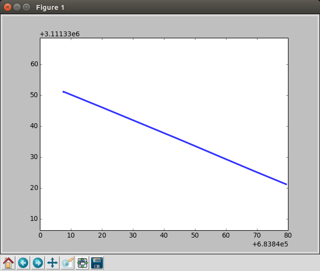

3.2对裸数据进行平滑处理

如果录制数据时，车辆行驶不够平顺，提取的裸轨迹数据可能会不光滑，有必要对其进行平滑处理。继续在Docker内部使用如下命令完成平滑处理：

| 1    | bash smooth.sh ./path_2018-04-01-09-58-00.bag.txt 200 |
| ---- | ----------------------------------------------------- |
|      |                                                       |

 

**注意：上述命令中200是平滑处理的长度，该值一般为150-200，如果执行失败，可尝试调整该参数，再次进行平滑。

为了验证平滑结果的正确性，可以使用如下命令查看：

| 1    | python viewer_smooth.py ./path_2018-04-01-09-58-00.bag.txt ./path_2018-04-01-09-58-00.bag.txt.smoothed |
| ---- | ------------------------------------------------------------ |
|      |                                                              |

 

其中，第一个参数./path_2018-04-01-09-58-00.bag.txt是裸数据，第二个参数./path_2018-04-01-09-58-00.bag.txt.smoothed是平滑结果，显示效果类似下图：

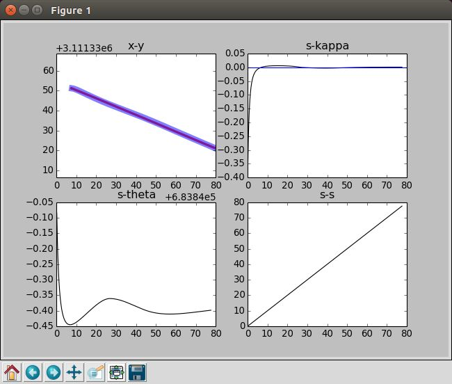

{  四  }

Dreamview前端的编译及配置

Dreamview前端默认使用Baidu地图，也可修改为Google地图，但需重新编译Dreamview前端，并正确设置UTM区域，具体方法如下（**注意：如不需修改地图设置，可忽略4.1-4.2步，直接执行4.3步）：

4.1更改导航地图

打开文件[apollo项目根目录]/modules/dreamview/frontend/src/store/config/ parameters.yml，根据需要将下述内容替换为Google地图或Baidu地图：

| 1234567 | navigation:  # possible options: BaiduMap or GoogleMap  map: "BaiduMap"  # Google Map API: "https://maps.google.com/maps/api/js"  # Baidu Map API: "https://api.map.baidu.com/api?v=3.0&ak=0kKZnWWhXEPfzIkklmzAa3dZ&callback=initMap"  mapAPiUrl: "https://api.map.baidu.com/api?v=3.0&ak=0kKZnWWhXEPfzIkklmzAa3dZ&callback=initMap" |
| ------- | ------------------------------------------------------------ |
|         |                                                              |

 

4.2重新编译Dreamview前端

按照步骤1.2的方法进入Docker，运行如下命令编译Dreamview前端：

| 123456 | # 安装Dreamview前端依赖包，注意：该步骤只需执行一次，不必每次执行cd /apollo/modules/dreamview/frontend/yarn install# 编译Dreamview前端cd /apollobash apollo.sh build_fe |
| ------ | ------------------------------------------------------------ |
|        |                                                              |

 

编译过程可能会出现如下错误：

| 1234 | ERROR in ../~/css-loader!../~/sass-loader/lib/loader.js?{"includePaths":["./node_modules"]}!./styles/main.scss**Module build failed: Error: ENOENT: no such file or directory, scandir '/apollo/modules/dreamview/frontend/node_modules/node-sass/vendor'*...（后面还有一长串，不再一一列出） |
| ---- | ------------------------------------------------------------ |
|      |                                                              |

 

这是内部依赖包不一致造成的，解决方法如下：

在Docker内部，运行如下命令（注意：一定要保持网络畅通，否则无法重新下载依赖包）：

| 12345 | cd /apollo/modules/dreamview/frontend/rm -rf node_modulesyarn installcd /apollobash apollo.sh build_fe |
| ----- | ------------------------------------------------------------ |
|       |                                                              |

 

4.3配置UTM区域ID

打开文件[apollo项目根目录]/modules/common/data/global_flagfile.txt，在最后一行添加如下语句（这是长沙地区的UTM区域ID，中国UTM分区可参考该网页【http://www.360doc.com/content/14/0729/10/3046928_397828751.shtml】）：

| 1    | --local_utm_zone_id=49 |
| ---- | ---------------------- |
|      |                        |

 

{  五  }

导航模式的使用 5.1打开Dreamview并开启导航模式

进入Docker，启动Dreamview，命令如下：

| 1234567 | cd your_apollo_project_root_dir# 如果没有启动Docker，首先启动，否则忽略该步bash docker/scripts/dev_start.sh -C# 进入Dockerbash docker/scripts/dev_into.sh# 启动Dreamview后台服务bash scripts/bootstrap.sh |
| ------- | ------------------------------------------------------------ |
|         |                                                              |

 

若是线下模拟测试，则将步骤二中录制好的数据包/apollo/data/bag/2018-04-01-09-58-00.bag（这是我机器上的录制数据）循环播放；若是实车调试，则忽略该步骤。

| 12   | # 模拟测试情形下，循环播放录制数据；实车调试情形忽略该步骤rosbag play -l /apollo/data/bag/2018-04-01-09-58-00.bag |
| ---- | ------------------------------------------------------------ |
|      |                                                              |

 

在浏览器中打开网页http://localhost:8888（注意不要使用代理），进入Dreamview界面，点击右上方下拉框，将模式设置为Navigation（导航模式），如下图所示：

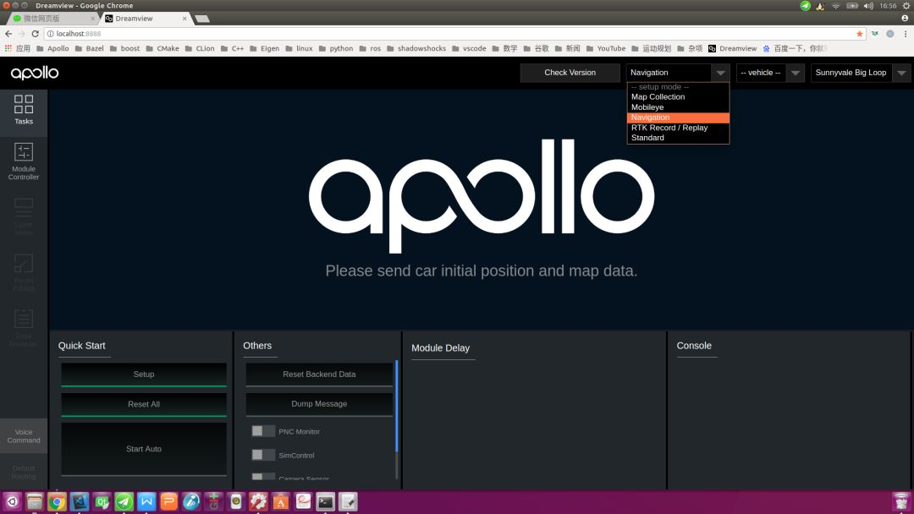

5.2打开Dreamview导航模式选项

点击Dreamview界面左侧工具栏中的Module Controller按钮，进入模块控制页面。若是线下模拟测试，选中Relative Map、Navi Planning选项，其他模块根据需要开启，如下图所示（图中显示空白文本的模块是Mobileye模块，需安装配置好相关硬件后才可见））：

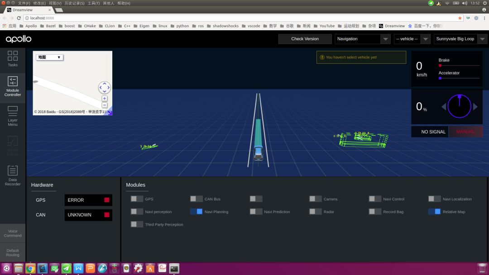

若是实车调试，建议除Record Bag、Mobileye（若Mobileye硬件未安装，则会显示为空白文本）和Third Party Perception模块外，其余模块全部开启，如下图所示：

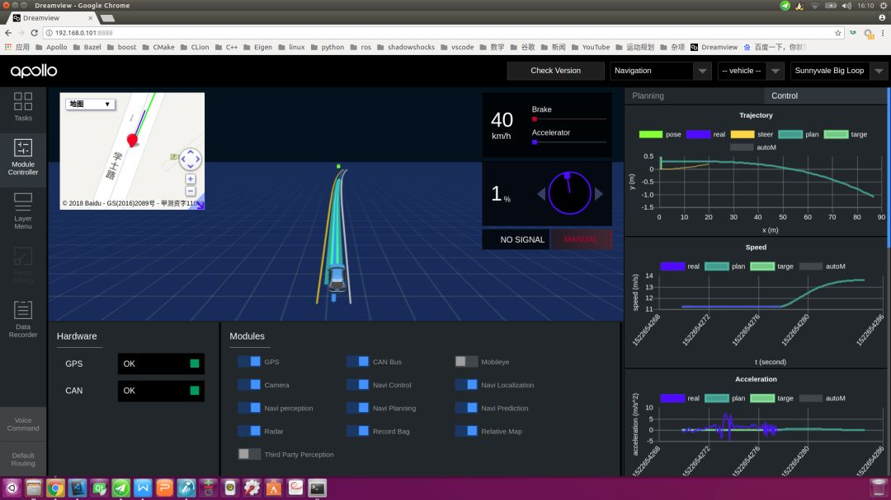

5.3发送参考线数据

在Docker内部，使用如下命令发送步骤三中制作的参考线数据：

| 12   | cd /apollo/modules/tools/navigatorpython navigator.py ./path_2018-04-01-09-58-00.bag.txt.smoothed |
| ---- | ------------------------------------------------------------ |
|      |                                                              |

 

下图是线下模拟测试情形下Dreamview接收到参考线后的界面，注意界面左上角已出现了百度地图界面，我们发送的参考线在百度地图中以红线方式、在主界面中以白色车道线的方式展现。

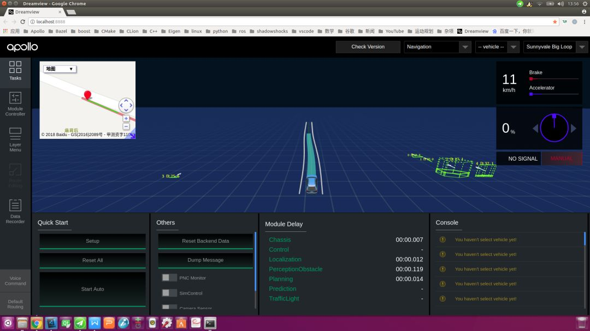

下图是实车调试情形下的Dreamview接收到参考线后的界面，注意界面左上角已出现了百度地图界面，我们发送的参考线在百度地图中以红线方式、在主界面中以黄色车道线的方式展现。

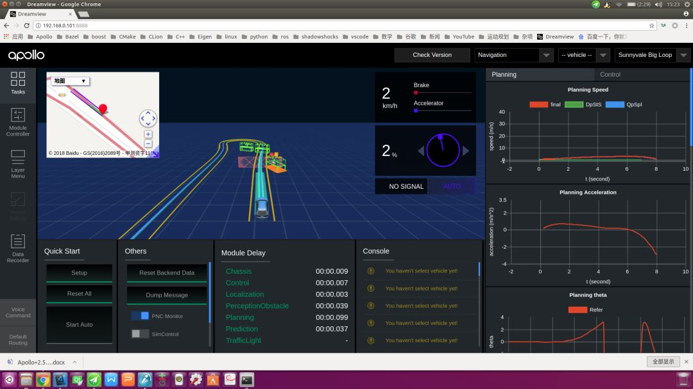

需注意以下几点：

(1) 如果发送参考线数据后，Dreamview界面不能正确显示参考线，可能有以下方面的原因：一是参考线数据未正确发送，解决办法是再次执行发送命令；二是浏览器缓存不一致，解决办法是按Ctrl + R或F5键刷新显示，或者清理浏览器缓存；三是Dreamview后台服务程序运行异常，解决办法是在Docker内部重启Dreamview后台服务，命令如下：

| 1234 | # 停止Dreamview后台服务bash scripts/bootstrap.sh stop# 重新启动Dreamview后台服务bash scripts/bootstrap.sh |
| ---- | ------------------------------------------------------------ |
|      |                                                              |

 

(2) 每次车辆重新回到起点后，无论是线下模拟测试还是实车调试情形，均需再次发送参考线数据。

本文介绍了Apollo 2.5版基于相对地图的新导航模式，新特性将有效降低开发者的使用门槛。希望本文对大家有所帮助！

自Apollo平台开放已来，我们收到了大量开发者的咨询和反馈，越来越多开发者基于Apollo擦出了更多的火花，并愿意将自己的成果贡献出来，这充分体现了Apollo『贡献越多，获得越多』的开源精神。为此我们开设了『开发者说』板块，希望开发者们能够踊跃投稿，更好地为广大自动驾驶开发者营造一个共享交流的平台！


 赞(1)

收藏


相关话题

- [导航](http://m.elecfans.com/tags/%E5%AF%BC%E8%88%AA.html)

  +关注

- [自动驾驶](http://m.elecfans.com/tags/%E8%87%AA%E5%8A%A8%E9%A9%BE%E9%A9%B6.html)

  +关注

- [Apollo](http://m.elecfans.com/tags/Apollo.html)

  +关注

查看


电子发烧友网

收听电子行业动态，抢先知晓半导体行业

评论(0)

[登录](http://m.elecfans.com/login/index.html) 后参与评论

相关文章

- 

  心大!司机睡着了,特斯拉自动驾驶狂奔50公里!

  58次阅读 2019-06-16

- 

- 

  自动驾驶模拟仿真系统中的传感器模型

  59次阅读 2019-06-16

- 

- 

- 

  大众福特联盟谈判终局 共创自动驾驶合资企业

  85次阅读 2019-06-16

- 

- 

  用于自动驾驶车辆的速度控制的参数

  82次阅读 2019-06-16

- 

  目标检测二十年的技术综述和总结及未来的发展方向详细分析

  37次阅读 2019-06-16

- 

- 

  华为“造车”,为时未晚!

  241次阅读 2019-06-16

- 

- 

  打造工业级稳定可靠的AGV导航方案

  61次阅读 2019-06-16

- 

  视觉成像助力感知决策 图像增强引擎赋能自动驾驶

  489次阅读 2019-06-15

- 

- 

  总投资18.96亿元 国家智能网联汽车测试区开园一周年

  460次阅读 2019-06-14

- 

- 

  谁，才是中国最强的自动驾驶之城？

  349次阅读 2019-06-14

- 

  全面解读自动驾驶的关键组成部分

  326次阅读 2019-06-14

- 

- 

  中国自动驾驶汽车产业区域发展评价报告2019

  325次阅读 2019-06-14

- 

- 

  5G对于自动驾驶意味着什么？

  483次阅读 2019-06-13

- 

  华为入局车企 使早已竞争激烈的战场更加惨烈

  681次阅读 2019-06-13

- 

- 

  自动驾驶芯片、传感器及厂家分析

  596次阅读 2019-06-13