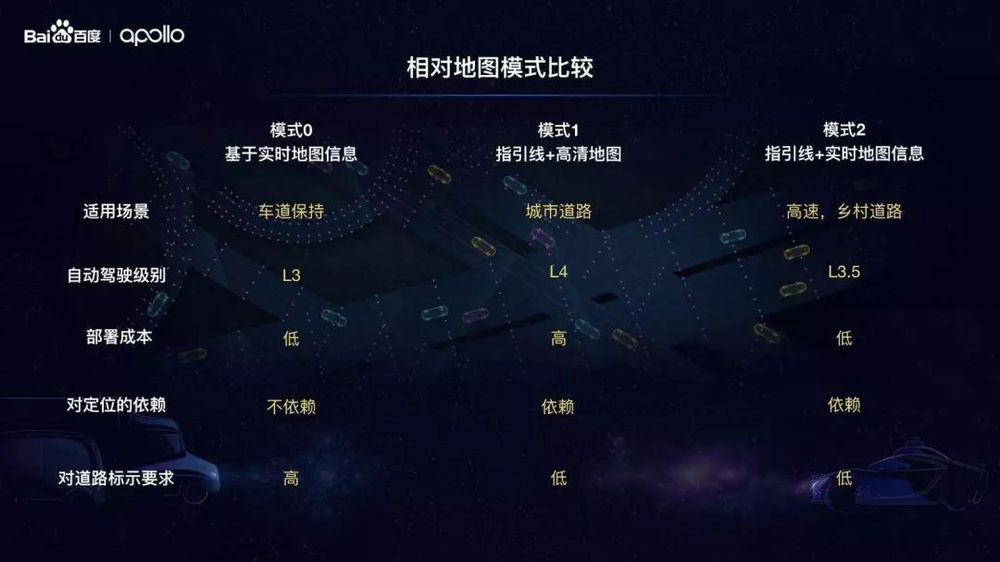
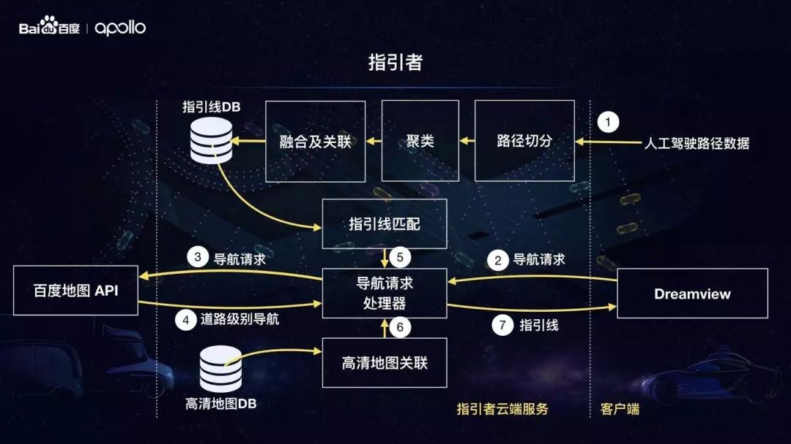
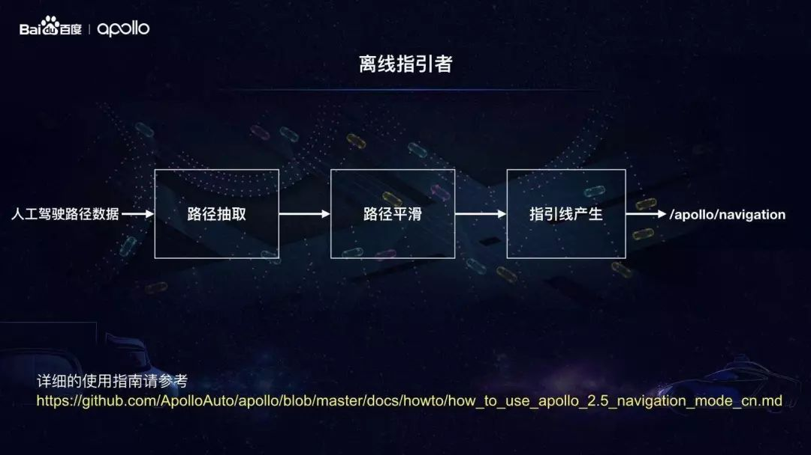
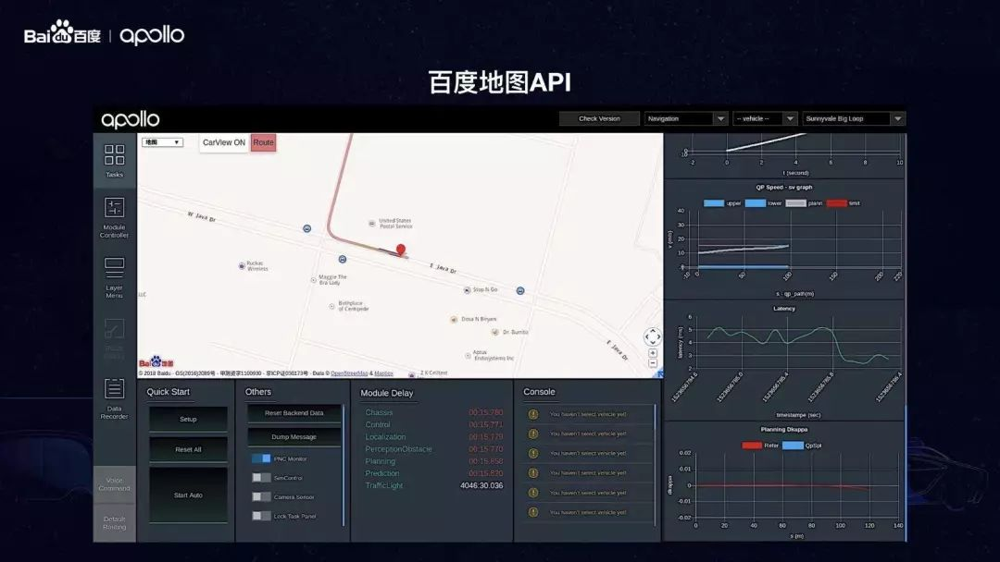
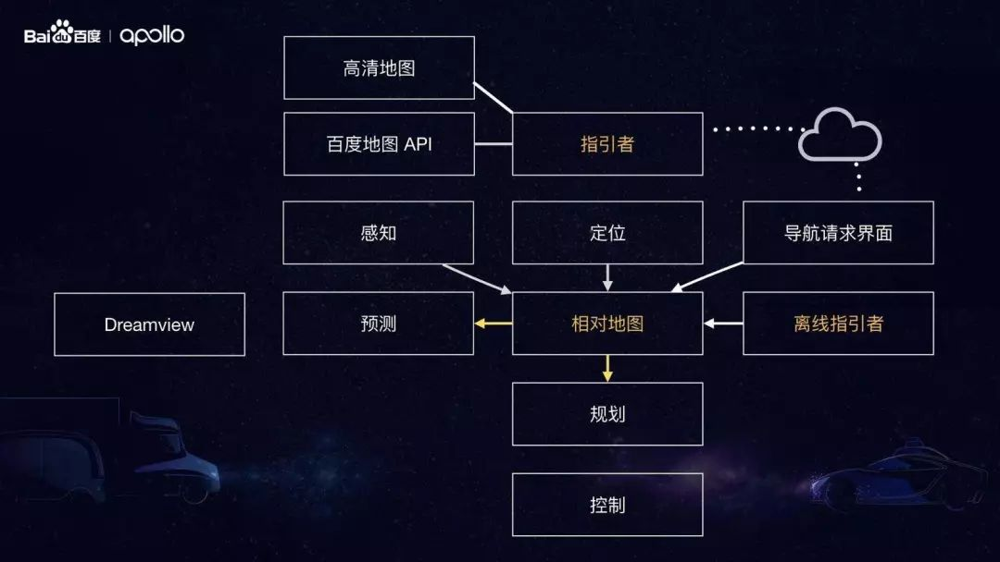

### apollo相对地图

​	相对地图是Apollo2.5引入的新特性。从架构层面，相对地图模块是连接高精地图(HD Map)、感知(Perception)模块和规划(Planning)模块的中间层。相对地图模块会实时生成基于车身坐标系的地图（格式与高精地图一致），其原点位于车辆本身，并且输出供规划模块使用的参考线。基于相对地图的导航模式，让开发者可以不依赖高精地图便可实施测试道路的实车调试，

​	导航模式的基本思路是:**通过人工驾驶方式录制测试道路上的行驶轨迹**；

​	利用Apollo工具对原始轨迹进行处理得到平滑轨迹，该轨迹既用于替代路由(Routing)模块输出的导航路径，也是规划(Planning)模块用到的参考线（或称指引线、中心线，Reference line），还是生成相对地图（Relative Map）的基准线。此外，平滑轨迹还可用于替换高精地图内某些车道的参考线（默认情况下，高精地图将车道中心线作为参考线，在道路临时施工等特殊情形下该方式很不合适，需使用人工录制并平滑处理的轨迹替换特殊路段的车道参考线）；

​	自动驾驶过程中，感知（Perception）模块的相机（Camera）动态检测道路边界及障碍物，地图（Map）模块下的相对地图（Relative Map）子模块基于参考线及道路边界实时地生成相对地图（使用以车辆当前位置为原点的相对坐标系），规划（Planning）模块依据地图模块输出的相对地图和感知模块输出的障碍物信息，动态输出局部行驶路径给控制(Control)模块执行。目前，导航模式仅支持单车道行驶，可完成加减速、跟车、遇障碍物减速停车或在车道宽度允许的情形下对障碍物绕行等功能，后续版本的导航模式将会进一步完善以支持多车道行驶、交通标志和红绿灯检测等。

​	在相对地图中，车道线数据是通过基于摄像头的车道感知而生成的，并且包含基于云端的导航线（NavigationLine）。相对地图实时基于摄像头生成，生成范围距离是一个可调参数。我们目前设置的是300米，当摄像头看不到300米时，我们会根据可见数据进行预测补足至300米。

#### 相对地图的优点？

​	为了将有不同特点和格式的实时地图信息和静态地图信息更好的结合在一起，同时也为了给规划和控制模块提供统一的接口。我们设计和开发了**相对地图模块**。相对地图有如下两个特点：

- 首先，产生的地图数据是相对于车的车身坐标系，这也是为什么该模块被命名为相对地图；在车身坐标系下，车辆坐标永远在原点，车头方向永远为0。
- 其次，地图数据会根据车的位置和朝向的变化实时更新，更新频率是10Hz。

相对地图采用车身坐标系，而不是全局坐标系，有两个原因：

- 第一，感知模块的原始数据输出是基于车身坐标系。采用车身坐标系，我们就不需要把感知的输出再转化成全局坐标系。这样减少了转化带来的误差，也减少了转化的计算量。
- **第二，在相对地图的一些模式下，只能使用车身坐标系，比如在定位不存在或者不准确的时候。**为了使相对地图能够在所有模式下进行无缝实时切换，我们统一了坐标系到车身坐标系。同时规划和控制模块也能够无感的处理不同的输入和场景。

​	不管是基于实时地图信息还是静态地图信息，相对地图对规划和控制模块提供了接口统一的地图数据。**这些地图数据约束和限制着规划和控制模块产生的轨迹和速度。**比如，数据中的车道线限制规划路径要在左右车道线之间。再比如地图中的红绿灯停止线限制车辆在红灯时不能超过停止线。这种约束性的地图信息，使得规划和控制模块能够进行严谨而且精确的数学建型，然后进行数学优化，得到最优的规划结果。但同时也带来了一系列的问题。

第一，约束信息必须准确而且完整。因为缺失任何一个约束条件都会导致错误的规划。这样的要求会增加地图的成本。

**第二，每一个约束条件需要标注各种交规相关的属性**，比如，一个车道线，可能是白虚线，也可能是黄实线。不同的交规属性会影响规划和控制的输出。另外每一种约束也可能会有它的物理属性，比如一个路的边界可能是一个马路牙子，也可能是一道铁栅栏，甚至是一个悬崖。这种物理属性，也会影响规划和控制的输出。这些标注会增加地图制作标注的复杂性。

**第三，现实世界中，不是每一个约束都明显的存在。**比如在路口里面或者老旧的路面，车道线并没有标示出来。因为约束的完整性要求，我们必须要填补这些缺失，而且在填补时，需要考虑规划和控制的特性。这样就增加了地图制作的难度，也不能和规划控制进行很好的解偶。

#### 导航线

​	为了在Apollo系统中引入指引线，我们加入了一个新的模块，叫**指引者**。指引者连接者高清地图和相对地图，为相对地图提供引导信息。 它即可以单独使用也可以和高清地图配合使用。这样相对地图为规划和控制不仅可以提供约束，也提供了引导。根据约束和引导的重要性的不同，相对地图提供了三大模式。

导航线在自动驾驶中扮演着多种角色。

- 导航线作为出发点与目的地点的连接线，提供车道级别导航；

- 导航线可以生成Referenceline用于驾驶决策；

- 为高精地图提供载体；

- 导航线是相对地图的重要组成部分。


导航线有以下特点：

- 导航线是按照驾驶员驾驶路径设计，所以安全性和舒适性是有保障的；

- 更重要的是，基于驾驶数据，导航线可以自动生成，大大降低了开发成本；

- 可以与视觉感知系统配合生成基本的地图信息，可以适用于比较简单的驾驶场景，比如高速公路、乡村道路等；

- 导航线可以与高精地图结合，生成复杂的驾驶场景，例如城市道路。

#### 相对地图和SLAM的区别

​	其实SLAM问题可以描述为：汽车在未知环境中从一个未知位置开始移动，在移动过程中根据位置估计和地图进行自身定位，同时在自身定位的基础上建造增量式地图，实现汽车的自主定位和导航。

​	RelativeMap在基于指引线录制模式时，会依赖录制的指引线与实时摄像头信息生成RelativeMap，同时，依靠GPS定位；在基于纯摄像头模式时，并不进行自身定位和建造增量式地图，只依赖实时摄像头生成的车道线信息行驶

#### 工作流程：

1、在实现真正的自动驾驶之前，我们需要采集导航线，需要覆盖几乎所有的车道及行车可能。经过对驾驶员驾驶路径的采集，人工驾驶轨迹收集完成后会被自动转化成指引线，无需任何人工标注。有噪音的数据，以及过于频繁换道的数据在这个过程中也会被滤掉。最终生成的指引线（绿色）以车道为单位，也包含了车道之间的连接，比如掉头和左右拐弯。

2、请求云端普通导航地图（百度地图or谷歌地图），请求道路级别的routing，生成A到B点的轨迹

3、在接到导航需求时，拿道路级别的routing去和之前生成的指引线进行匹配，得到A点到B点之间的多条指引线（为了给下游的规划和控制模块更多的灵活性）为每一条指引线设置了不同的优先级，横向越接近终点的指引线优先级越高

4、无人车在进行无人驾驶的时候，相对地图模块根据指引线和实时车道线实时生成地图，并以10Hz的频率进行更新。在这个过程中，指引线被转化为车身坐标系，并作为车道中心线；从感知模块的到的车道线作为车道的左右边界；以上信息被融合在一起产生相对地图

#### 导航模式及应对场景

​	在行驶过程中，相对地图数据的计算和更新频率10Hz，相对地图数据来源一是基于视觉感知的车道标识，二是基于云端的导航线，而且相对地图支持以下三种自动驾驶场景：



##### 相对地图模式0，仅依靠视觉感知的车道标识（纯摄像头）

适用场景：GPS定位缺失、只有来自感知系统的车道线识别、车道保持与自适应巡航、只依赖于基于感知的实时地图信息。

​	当GPS失效时（比如通过某个隧道），指引线暂时不可用，系统将自动切换为基于纯摄像头模式，此相对地图只根据感知的实时车道线来生成地图信息，无人车可以继续进行L3级别的无人驾驶，属于车道保持或者自适应续航控制状态。

​	只要有车线可以辨别，车会沿着车道中心线一直开（LaneKeeping）。如果车道线不可辨别，这时相对地图的生成只根据指引线，车道边界会根据历史数据进行预测，或者根据左右侧指引线进行估算。一旦定位恢复，相对地图会自动切换回正常的指引线+实时车道线模式。

##### 相对地图模式1，依靠视觉感知、云端导航线以及高精地图(摄像头+GPS+高精地图)

适用场景：车道标识不是来自于感知系统检测，而是基于历史驾驶数据以及高精地图生成、能从云端获取导航线、城市道路

此条件下，导航线结合高精地图，能实现城市道路的规划决策。

##### 相对地图模式2，依靠视觉感知与云端导航线（摄像头+GPS）

适用场景：感知系统检测的车道标识、能从云端获取导航线、高速道路或者车道线不清晰的乡村道路

此条件下，导航线与感知系统结合生成地图数据，用于车辆决策。

**关于对定位的依赖：**由于模式0只使用感知数据，可以完全不依赖定位。模式1和模式2使用指引线或者高清地图，所以对定位有强依赖。

**关于对道路标示的要求**，即**路面交通线的清晰程度**：由于模式0是基于视觉对车道线进行识别，对标示清晰度要求高。其他两种模式由于有了指引线或者高清地图作为参考，对道路标示要求低。


#### 设计思想及模块细节？



​	指引者是一个云端服务，如上图的中间部分所示，指引者有两个数据库，一个存放**指引线数据**，另外一个存放**高清地图数据**。除此之外，还有一系列的数据处理及算法功能模块。为了使指引者能够提供指引线，我们首先要把线下采集的人工驾驶路径数据上传到云端（如图中步骤1所示）。

​	指引者会对数据进行一系列的处理，最终生成指引线并存储在数据库中。之后，用户会在Dreamview中选择目的地**发出导航请求**（如图所示步骤2）。指引者中的导航请求处理器会**接受导航请求并转发给百度地图API**（图中步骤3），并从百度地图API得到道路级别的导航（步骤4）。导航处理器会**根据道路级别的导航进行指引线匹配**（步骤5）得到指引线。如果有相应的高清地图数据存在，指引线会和周边的高清地图进行关联（步骤6）。最终，指引线会传回给Dreamview（步骤7）。Dreamview得到指引线数据后发送给下游模块，比如预测模块和规划模块。



​	除了云端服务，Apollo也提供了一个离线指引者的工具，供开发者在没有网络的情况下，或者在私人封闭测试场中使用指引线和相对地图。这个工具可以把收集到的人工驾驶数据进行一系列的处理包括：**路径抽取，路径平滑，和指引线产生**。最终把生成的指引线数据发送到 ROS topic “/apollo/navigation”。 这样相对地图就可以收到指引线，并产生相对地图。 相对地图是如何利用和集成百度地图API，以及这样的设计带来的好处。



**首先，我们利用百度地图为用户提供发送导航请求的界面。**如上图所示，用户可以在地图界面中选择一个目的地，然后点击左上角的红色Route按钮。这样的一个体验就像用户在手机上使用百度地图导航一样。

**其次，在无人驾驶过程中，我们会把无人车的位置实时显示在地图上，为乘客提供当前位置的信息。**如上图所示，百度地图中间的红色位置图标就是无人车的当前位置。

**最后，也是最重要的，我们利用百度地图的导航API为指引者提供了道路级别的导航。**这样的道路级别导航保证了行车线路的准确性，同时也考虑了实时路况，为最终匹配到精确的合理的指引线提供了保障。



上面这张图总结**相对地图和指引者和Apollo中各个模块之间的关系。**这张图的中间是相对地图模块，它依赖于感知，定位和指引线。指引线可以由云端指引线产生，也可以由离线的指引者工具产生。相对地图会融合各种地图信息，根据路况条件和输入数据，工作在不同的模式下。生成的相对地图数据，会传给预测和规划模块。**云端指引线连接着高清地图和百度地图API。**


### 参考线采集及制作

#### 1、Apollo 2.5版的构建

​	首先从GitHub网站【https://github.com/ApolloAuto/apollo】下载Apollo2.5版源代码，可以使用git命令下载，也可以直接通过网页下载压缩包。源代码下载完成并放置到合适的目录后，可以使用两种方法构建：1.在Visual Studio Code中构建（推荐）；2.使用命令行构建。当然，两种方法都有一个前提，就是在你的机器上已经顺利安装了Docker。Apollo之前版本提供了一个install_docker.sh脚本文件，因为很多开发者反映可能出错，Apollo项目组已将该文件移除。现在要安装Docker就只能参考Docker官方网站的帮助文档了。

##### 1.1在Visual Studio Code中构建

打开Visual Studio Code，执行菜单命令文件->打开文件夹，在弹出的对话框中，选择Apollo项目源文件夹，点击“确定”，如下图所示：


之后，执行菜单命令任务->运行生成任务或直接按快捷键Ctrl+Shift+B（与Visual Studio和QT的快捷键一致）构建工程，若之前没有启动过Docker，则编译时会启动Docker，需在底部终端窗口输入超级用户密码。命令执行完毕，若在底部提示 构建成功 的信息（如下图所示），则表示构建成功。整个过程一定要保持网络畅通，否则无法下载依赖包。构建过程可能会遇到一些问题，解决方法可直接查看GitHub网站的帮助文档.


##### 1.2在命令行中构建

```bash
# 按快捷键Ctrl + Alt + T打开命令行终端，输入如下命令启动Docker：
cd your_apollo_project_root_dir# 从中国大陆访问，最好加上“-C”选项，直接访问中国大陆镜像服务器以获取更快的下载速度
bash docker/scripts/dev_start.sh -C

# 输入如下命令进入Docker：
bash docker/scripts/dev_into.sh

#在Docker内部，执行如下命令构建Apollo项目：
bash apollo.sh build
```

整个操作如下图所示：


##### 1.3修改定位模块UTM区域ID

Apollo项目定位(Localization)模块默认使用美国西部UTM坐标，在国内需要修改该值。在Docker外部，使用vi或其他文本编辑器，打开文件[apollo项目根目录]/modules/localization/conf/localization.conf，将下述内容：

```
--local_utm_zone_id=10
```

修改为下述内容（这是长沙地区的UTM区域ID，中国UTM分区可参考该网页【http://www.360doc.com/content/14/0729/10/3046928_397828751.shtml】）：

```
--local_utm_zone_id=49
```

注意：如果录制数据时未修改上述内容，则线下模拟测试回放数据包时只能将错就错，千万不能再修改该值，否则地图上的参考线定位会出错！有一次我采集数据时，忘了修改该值，回放数据时又进行修改，结果导致参考线定位到了美国西海岸！我取消修改，按F5键刷新浏览器后显示就恢复正常了。

#### 2、参考线原始数据的采集

将构建好的Apollo项目文件导入车内工控机，并按照步骤1.2的方法进入Docker，再执行如下命令，启动Dreamview服务端程序：

```bash
bash scripts/bootstrap.sh
```

在浏览器中打开网页http://localhost:8888（注意不要使用代理），进入Dreamview界面，如下图所示：


1、驾驶员将车辆驶入待测试路段起点；

2、操作员点击Dreamview界面左侧工具栏中的Module Controller按钮，进入模块控制页面，选中GPS、Localization、Record Bag选项，注意：如果采集的数据包需用于线下模拟测试，还需加上CAN Bus选项。


3、驾驶员从起点启动车辆并按预定路线行驶至终点；

4、操作员关闭Dreamview界面中的Record Bag选项，此时会在/apollo/data/bag目录（这是Docker中的目录，宿主机上对应的目录为[你的apollo根目录]/data/bag）中生成一个类似于2018-04-01-09-58-00的目录，该目录中保存着类似于2018-04-01-09-58-00.bag的数据包。这就是我们所需的数据包，请记住它的路径及名称。**注意：单个数据包文件的默认录制时长为1分钟，默认文件大小为2048MB，可通过修改文件/apollo/scripts/record_bag.sh来改变默认值。**

为后文阐述方便起见，我假设数据包2018-04-01-09-58-00.bag直接存放于/apollo/data/bag目录。

#### 3、参考线的制作

参考线的制作既可在车内工控机内完成，也可在其他计算机上实施。无论在哪台计算机上制作，我们首先假定已按步骤1.2的方法进入Docker，并按照步骤二中录制的数据包放置在/apollo/data/bag目录中，且假定该文件名为2018-04-01-09-58-00.bag（在你的机器上并非如此，这样做只是为了后文阐述方便而已）。

##### 3.1从原始数据包提取裸数据

在Docker内部，使用如下命令从原始数据包提取裸数据：

```
cd /apollo/modules/tools/navigatorpython extractor.py /apollo/data/bag/2018-04-01-09-58-00.bag
```

上述命令会在当前目（易知我们在/apollo/modules/tools/navigator目录中）生成一个提取后的裸数据文件：path_2018-04-01-09-58-00.bag.txt。为了验证裸数据的正确性，可以使用如下命令查看：

```
python viewer_raw.py ./path_2018-04-01-09-58-00.bag.txt
```

会显示类似下图的路径图：


##### 3.2对裸数据进行平滑处理

如果录制数据时，车辆行驶不够平顺，提取的裸轨迹数据可能会不光滑，有必要对其进行平滑处理。继续在Docker内部使用如下命令完成平滑处理：

```bash
bash smooth.sh ./path_2018-04-01-09-58-00.bag.txt 200
```

**注意：上述命令中200是平滑处理的长度，该值一般为150-200，如果执行失败，可尝试调整该参数，再次进行平滑**。

为了验证平滑结果的正确性，可以使用如下命令查看：

```bash
python viewer_smooth.py ./path_2018-04-01-09-58-00.bag.txt ./path_2018-04-01-09-58-00.bag.txt.smoothed
```

其中，第一个参数./path_2018-04-01-09-58-00.bag.txt是裸数据，第二个参数./path_2018-04-01-09-58-00.bag.txt.smoothed是平滑结果，显示效果类似下图：


#### 4、Dreamview前端的编译及配置

Dreamview前端默认使用Baidu地图，也可修改为Google地图，但需重新编译Dreamview前端，并正确设置UTM区域，具体方法如下（**注意：如不需修改地图设置，可忽略4.1-4.2步，直接执行4.3步）：

##### 4.1更改导航地图

打开文件[apollo项目根目录]/modules/dreamview/frontend/src/store/config/ parameters.yml，根据需要将下述内容替换为Google地图或Baidu地图：

```b
navigation:  # possible options: BaiduMap or GoogleMap  map: "BaiduMap"  
# Google Map API: "https://maps.google.com/maps/api/js"  
# Baidu Map API: "https://api.map.baidu.com/api?v=3.0&ak=0kKZnWWhXEPfzIkklmzAa3dZ&callback=initMap"  mapAPiUrl: "https://api.map.baidu.com/api?v=3.0&ak=0kKZnWWhXEPfzIkklmzAa3dZ&callback=initMap"
```

##### 4.2重新编译Dreamview前端

按照步骤1.2的方法进入Docker，运行如下命令编译Dreamview前端：

```bash
# 安装Dreamview前端依赖包，注意：该步骤只需执行一次，不必每次执行
cd /apollo/modules/dreamview/frontend/yarn install
# 编译Dreamview前端
cd /apollobash apollo.sh build_fe
```

编译过程可能会出现如下错误：

```
ERROR in ..//css-loader!..//sass-loader/lib/loader.js?{"includePaths":["./node_modules"]}!./styles/main.scss*Module build failed: Error: ENOENT: no such file or directory, scandir '/apollo/modules/dreamview/frontend/node_modules/node-sass/vendor'...（后面还有一长串，不再一一列出）
```

这是内部依赖包不一致造成的，解决方法如下：

在Docker内部，运行如下命令（注意：一定要保持网络畅通，否则无法重新下载依赖包）:

```bash
cd /apollo/modules/dreamview/frontend/rm -rf node_modulesyarn installcd /apollobash apollo.sh build_fe
```

##### 4.3配置UTM区域ID

打开文件[apollo项目根目录]/modules/common/data/global_flagfile.txt，在最后一行添加如下语句（这是长沙地区的UTM区域ID，中国UTM分区可参考该网页【http://www.360doc.com/content/14/0729/10/3046928_397828751.shtml】）：

```
--local_utm_zone_id=49
```

#### 5、导航模式的使用

##### 5.1打开Dreamview并开启导航模式

进入Docker，启动Dreamview，命令如下：

```bash
cd your_apollo_project_root_dir
# 如果没有启动Docker，首先启动，否则忽略该步
bash docker/scripts/dev_start.sh -C
# 进入Docker
bash docker/scripts/dev_into.sh
# 启动Dreamview后台服务
bash scripts/bootstrap.sh
```

若是线下模拟测试，则将步骤二中录制好的数据包/apollo/data/bag/2018-04-01-09-58-00.bag（这是我机器上的录制数据）循环播放；若是实车调试，则忽略该步骤。

```bash
# 模拟测试情形下，循环播放录制数据；实车调试情形忽略该步骤
rosbag play -l /apollo/data/bag/2018-04-01-09-58-00.bag
```

在浏览器中打开网页http://localhost:8888（注意不要使用代理），进入Dreamview界面，点击右上方下拉框，将模式设置为Navigation（导航模式），如下图所示：


##### 5.2打开Dreamview导航模式选项

点击Dreamview界面左侧工具栏中的Module Controller按钮，进入模块控制页面。若是线下模拟测试，选中Relative Map、Navi Planning选项，其他模块根据需要开启，如下图所示（图中显示空白文本的模块是Mobileye模块，需安装配置好相关硬件后才可见））：


若是实车调试，建议除Record Bag、Mobileye（若Mobileye硬件未安装，则会显示为空白文本）和Third Party Perception模块外，其余模块全部开启，如下图所示：


##### 5.3发送参考线数据

在Docker内部，使用如下命令发送步骤三中制作的参考线数据：

```bash
cd /apollo/modules/tools/navigatorpython navigator.py ./path_2018-04-01-09-58-00.bag.txt.smoothed
```

下图是线下模拟测试情形下Dreamview接收到参考线后的界面，注意界面左上角已出现了百度地图界面，我们发送的参考线在百度地图中以红线方式、在主界面中以白色车道线的方式展现。


下图是实车调试情形下的Dreamview接收到参考线后的界面，注意界面左上角已出现了百度地图界面，我们发送的参考线在百度地图中以红线方式、在主界面中以黄色车道线的方式展现。


需注意以下几点：

(1) 如果发送参考线数据后，Dreamview界面不能正确显示参考线，可能有以下方面的原因：一是参考线数据未正确发送，解决办法是再次执行发送命令；二是浏览器缓存不一致，解决办法是按Ctrl + R或F5键刷新显示，或者清理浏览器缓存；三是Dreamview后台服务程序运行异常，解决办法是在Docker内部重启Dreamview后台服务，命令如下：

```bash
# 停止Dreamview后台服务
bash scripts/bootstrap.sh stop
# 重新启动Dreamview后台服务
bash scripts/bootstrap.sh
```

(2) 每次车辆重新回到起点后，无论是线下模拟测试还是实车调试情形，均需再次发送参考线数据。
