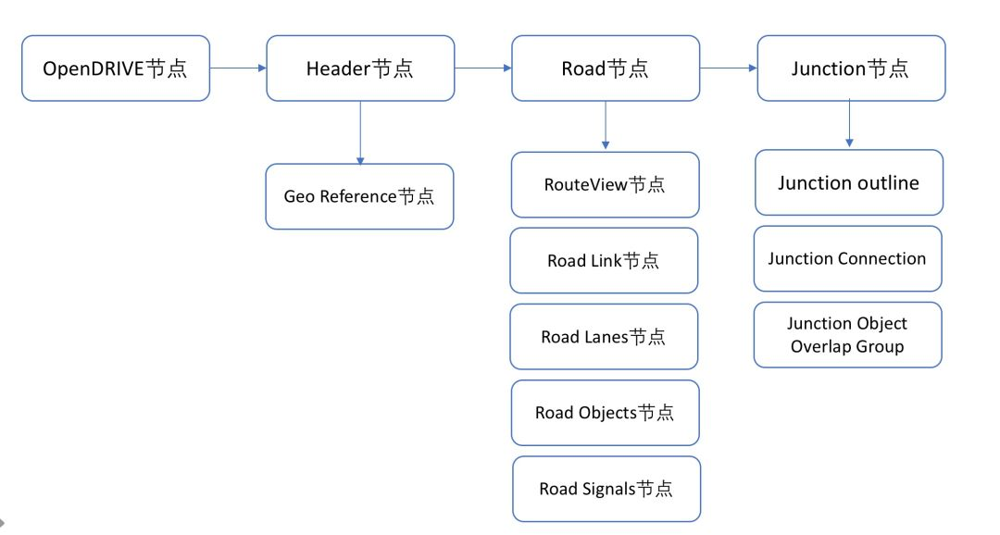
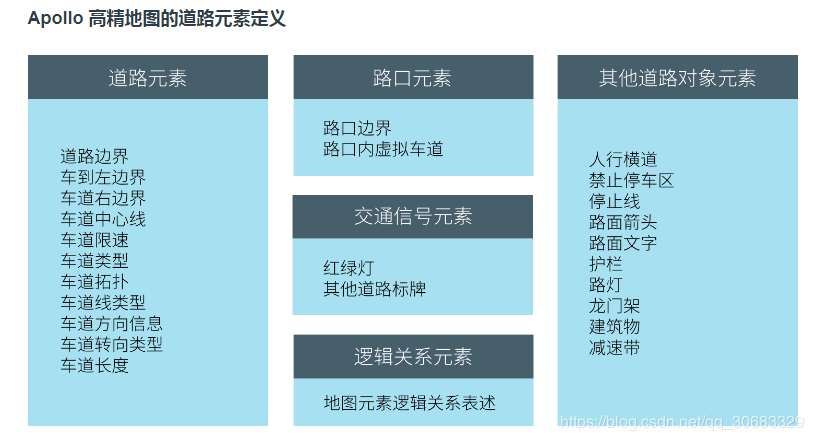
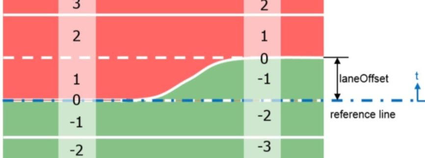
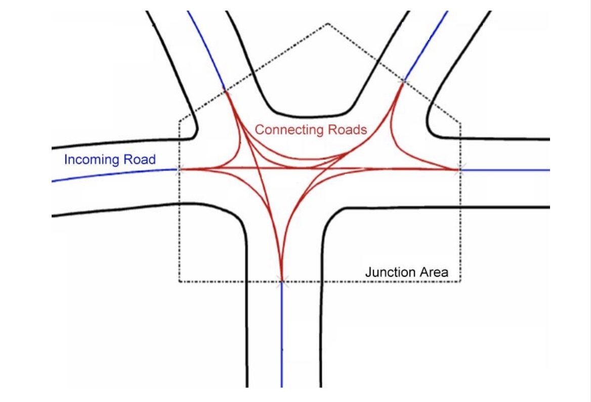

# Apollo高精地图

## 1、Apollo地图格式规范 

### 概述

百度高精地图数据格式采用（XML）文件格式的数据组织方式，是基于国际通用的OpenDrive规范。OpenDRIVE本身设计面向的应用是仿真器，自动驾驶需要更多的信息OpenDRIVE并没有完全提供，所以对OpenDRIVE的标准做了部分改动和扩展，改动和扩展后的规格在实现上更加的简单，同时也兼顾了无人驾驶的应用需求。改动主要体现在以下几个方面：

- 一是**地图元素形状的表述方式**。以车道边界为例，标准OpenDRIVE采用基于Reference Line的曲线方程和偏移的方式来表达边界形状，而Apollo OpenDrive采用**绝对坐标序列的方式**描述边界形状；

  > #### 坐标序列
  >
  > 任何点、线、面实体都可以用某一坐标系中的坐标点x,y 来表示。这里x,y 可以对应于大地坐标经度和纬度，也可以对应于平面坐标系坐标x 和y。
  >
  > 对于点，则是一对坐标;对于线，则是一个坐标串; 对于多边形，则是一条或多条线组成的封闭曲线坐标串，坐标必须首尾相同

- 二是**元素类型的扩展**。例如新增了对于禁停区、人行横道、减速带等元素的独立描述；

- 三是**扩展了对于元素之间相互关系的描述**。比如新增了junction与junction内元素的关联关系等；

- 除此之外还有一些配合无人驾驶算法的扩展，比如增加了车道中心线到真实道路边界的距离、停止线与红绿灯的关联关系等。

### 整体架构

Apollo高精地图文件的整体结构如下所示



### 道路元素定义



####  车道

道路的reference line 存储在ID为0的车道中，其他车道只存储当前车道的一个边界。例如，reference line右侧的车道只存储车道的右侧边界。

[](http://www.51apollo.com/wp-content/uploads/2018/03/20180323002.jpg)

车道 ID 的命名规则:

- lane section 内唯一

- 数值连续的

- reference line 所在 lane 的 ID 为 0

- reference line 左侧 lane 的 ID 向左侧依次递增 (正t轴方向)

- reference line 右侧 lane 的 ID 向右侧依次递减(负 t 轴方向)

- reference line 必须定义在<center>节点内

- 车道总数目没有限制。Reference line 自身必须为 Lane 0。

#### 路口区域（Juction）

基本的原理比较简单，路口区域用Junction结构表达。在Junction内，incoming Road通过Connecting Roads与out-going道路相连。下图展示了一个比较复杂的路口：



## 3、高精地图在Apollo的存在形式

xml格式的地图见modules/map/data/sunnyvale_big_loop/base_map.xml文件。

不管原始数据格式为什么，在Apollo内部的数据地图的格式为proto

### 如何从XML解析到proto？

主要是由方法opendrive_adapter.cc中的以下方法解析并读取：modules/map/hd_map/opendrive_adapter.cc

```c++
OpendriveAdapter::LoadData(const std::string& filename,apollo::hdmap::Map* pb_map)
```

用xml_parser解析opendrive格式的地图文件并用proto_organizer封装成protoco格式，就可以为Apollo中的多个模块，或者统一的方法所使用。

opendrive解析主要分为以下四个过程：

```c++
bool OpendriveAdapter::LoadData(const std::string& filename,
                                apollo::hdmap::Map* pb_map) {
  CHECK_NOTNULL(pb_map);

  tinyxml2::XMLDocument document;
  if (document.LoadFile(filename.c_str()) != tinyxml2::XML_SUCCESS) {
    AERROR << "fail to load file " << filename;
    return false;
  }

  // root node
  const tinyxml2::XMLElement* root_node = document.RootElement();
  CHECK(root_node != nullptr);
  // header
  PbHeader* map_header = pb_map->mutable_header();
  Status status = HeaderXmlParser::Parse(*root_node, map_header);
  if (!status.ok()) {
    AERROR << "fail to parse opendrive header, " << status.error_message();
    return false;
  }

  // roads
  std::vector<RoadInternal> roads;
  status = RoadsXmlParser::Parse(*root_node, &roads);
  if (!status.ok()) {
    AERROR << "fail to parse opendrive road, " << status.error_message();
    return false;
  }

  // junction
  std::vector<JunctionInternal> junctions;
  status = JunctionsXmlParser::Parse(*root_node, &junctions);
  if (!status.ok()) {
    AERROR << "fail to parse opendrive junction, " << status.error_message();
    return false;
  }

  ProtoOrganizer proto_organizer;
  proto_organizer.GetRoadElements(&roads);
  proto_organizer.GetJunctionElements(junctions);
  proto_organizer.GetOverlapElements(roads, junctions);
  proto_organizer.OutputData(pb_map);

  return true;
}
```


### Apollo高精地图的对象定义

modules/map/proto/map.proto

```protobuf
// This message defines how we project the ellipsoidal Earth surface to a plane.
message Projection {
  // PROJ.4 setting:
  // "+proj=tmerc +lat_0={origin.lat} +lon_0={origin.lon} +k={scale_factor} +ellps=WGS84 +no_defs"
  optional string proj = 1;
}

message Header {
  optional bytes version = 1;
  optional bytes date = 2;
  optional Projection projection = 3;//坐标系转换
  optional bytes district = 4;
  optional bytes generation = 5;
  optional bytes rev_major = 6;
  optional bytes rev_minor = 7;
  optional double left = 8;
  optional double top = 9;
  optional double right = 10;
  optional double bottom = 11;
  optional bytes vendor = 12;
}

message Map {
  optional Header header = 1;

  repeated Crosswalk crosswalk = 2;// 人行道
  repeated Junction junction = 3;//路口区域
  repeated Lane lane = 4;//车道
  repeated StopSign stop_sign = 5;//停止线
  repeated Signal signal = 6;//信号灯
  repeated YieldSign yield = 7;//让路标志
  repeated Overlap overlap = 8;//重叠区域
  repeated ClearArea clear_area = 9;//禁停区域
  repeated SpeedBump speed_bump = 10;//减速带
  repeated Road road = 11;//道路
}
```

#### 边界形状

modules/map/proto/map_geometry.proto

Apollo高精度地图OpenDrive采用绝对坐标序列的方式描述边界形状，依次为基础生成直线或类似直线的对象。

```protobuf
// Polygon, not necessary convex. 多边形
message Polygon {
  repeated apollo.common.PointENU point = 1;
}

// Straight line segment. 直线段
message LineSegment {
  repeated apollo.common.PointENU point = 1;
}

// Generalization of a line.  曲线
message CurveSegment {
  oneof curve_type {
    LineSegment line_segment = 1;
  }
  optional double s = 6;  // start position (s-coordinate)
  optional apollo.common.PointENU start_position = 7;
  optional double heading = 8; // start orientation
  optional double length = 9;
}

// An object similar to a line but that need not be straight.
message Curve {
  repeated CurveSegment segment = 1;
}
```

### 道路Road

```protobuf
message BoundaryEdge {
  optional Curve curve = 1;
  enum Type {
    UNKNOWN = 0;
    NORMAL = 1;
    LEFT_BOUNDARY = 2;
    RIGHT_BOUNDARY = 3;
  };
  optional Type type = 2;
}

message BoundaryPolygon {
  repeated BoundaryEdge edge = 1;
}

// boundary with holes
message RoadBoundary {
  optional BoundaryPolygon outer_polygon = 1;
  // if boundary without hole, hole is null
  repeated BoundaryPolygon hole = 2;
}

message RoadROIBoundary {
  optional Id id = 1;
  repeated RoadBoundary road_boundaries = 2;
}

// road section defines a road cross-section, At least one section must be defined in order to
// use a road, If multiple road sections are defined, they must be listed in order along the road
message RoadSection {
  optional Id id = 1;
  // lanes contained in this section
  repeated Id lane_id = 2;
  // boundary of section
  optional RoadBoundary boundary = 3;
}

// The road is a collection of traffic elements, such as lanes, road boundary etc.
// It provides general information about the road.
message Road {
  optional Id id = 1;
  repeated RoadSection section = 2;

  // if lane road not in the junction, junction id is null.
  optional Id junction_id = 3;
}
```

### 车道Lane

modules/map/proto/mao_lane.proto

```protobuf
message LaneBoundaryType {
  enum Type {
    UNKNOWN = 0;
    DOTTED_YELLOW = 1;
    DOTTED_WHITE = 2;
    SOLID_YELLOW = 3;
    SOLID_WHITE = 4;
    DOUBLE_YELLOW = 5;
    CURB = 6;
  };
  // Offset relative to the starting point of boundary
  optional double s = 1;
  // support multiple types
  repeated Type types = 2;
}

message LaneBoundary {
  optional Curve curve = 1;

  optional double length = 2;
  // indicate whether the lane boundary exists in real world
  optional bool virtual = 3;
  // in ascending order of s
  repeated LaneBoundaryType boundary_type = 4;
}

// Association between central point to closest boundary.
message LaneSampleAssociation {
  optional double s = 1;
  optional double width = 2;
}

// A lane is part of a roadway, that is designated for use by a single line of vehicles.
// Most public roads (include highways) have more than two lanes.
message Lane {
  optional Id id = 1;

  // Central lane as reference trajectory, not necessary to be the geometry central.
  optional Curve central_curve = 2;

  // Lane boundary curve.
  optional LaneBoundary left_boundary = 3;
  optional LaneBoundary right_boundary = 4;

  // in meters.
  optional double length = 5;

  // Speed limit of the lane, in meters per second.
  optional double speed_limit = 6;

  repeated Id overlap_id = 7;

  // All lanes can be driving into (or from).
  repeated Id predecessor_id = 8;
  repeated Id successor_id = 9;

  // Neighbor lanes on the same direction.
  repeated Id left_neighbor_forward_lane_id = 10;
  repeated Id right_neighbor_forward_lane_id = 11;

  enum LaneType {
    NONE = 1;
    CITY_DRIVING = 2;
    BIKING = 3;
    SIDEWALK = 4;
    PARKING = 5;
  };
  optional LaneType type = 12;

  enum LaneTurn {
    NO_TURN = 1;
    LEFT_TURN = 2;
    RIGHT_TURN = 3;
    U_TURN = 4;
  };
  optional LaneTurn turn = 13;

  repeated Id left_neighbor_reverse_lane_id = 14;
  repeated Id right_neighbor_reverse_lane_id = 15;

  optional Id junction_id = 16;

  // Association between central point to closest boundary.
  repeated LaneSampleAssociation left_sample = 17;
  repeated LaneSampleAssociation right_sample = 18;

  enum LaneDirection {
    FORWARD = 1;
    BACKWARD = 2;
    BIDIRECTION = 3;
  }
  optional LaneDirection direction = 19;

  // Association between central point to closest road boundary.
  repeated LaneSampleAssociation left_road_sample = 20;
  repeated LaneSampleAssociation right_road_sample = 21;
}
```

###  路口Junction

modules/map/proto/map_junction.proto

```protobuf
// An junction is the junction at-grade of two or more roads crossing.
message Junction {
  optional Id id = 1;
  optional Polygon polygon = 2;
  repeated Id overlap_id = 3;
}
```


### 地图结构及差异

一段道路的相关自动驾驶地图可以放置在如下结构的目录中：

```
sunnyvale_big_loop
├── background.jpg
├── background.png
├── base_map.bin
├── base_map.lb1
├── base_map.txt
├── base_map.xml               # Defined by FLAGS_base_map_filename
├── default_end_way_point.txt  # Defined by FLAGS_end_way_point_filename
├── grid_map
├── local_map
├── map.json
├── routing_map.bin            # Defined by FLAGS_routing_map_filename
├── routing_map.txt
├── sim_map.bin                # Defined by FLAGS_sim_map_filename
├── sim_map.txt
└── speed_control.pb.txt
```

### **base_map, routing_map**和**sim_map**之间的差异

- `base_map`是最完整的地图，包含所有道路和车道几何形状和标识。其他版本的地图均基于`base_map`生成。

- routing_map包含base_map中车道的拓扑结构，可以有以下命令生成：

```
dir_name=modules/map/data/demo     # example map directory 
./scripts/generate_routing_topo_graph.sh  --map_dir ${dir_name}
```

- sim_map是一个适用于Dreamview视觉可视化，基于base_map的轻量版本。减少了数据密度，以获得更好的运行时性能。可以由以下命令生成：

```
dir_name=modules/map/data/demo    # example map directory 
bazel-bin/modules/map/tools/sim_map_generator  --map_dir=${dir_name} --output_dir=${dir_name}
```

## 4、HD Map引擎


HDMAP引擎是Apollo里面用于从HDMAP里面提取相关元素给下游的一个模块。它的结构框图如上图所示。

HDMAP 引擎可以通过ID去检索一个元素，也可以通过空间位置查找元素，比如**给定一个点和半径，可以把这个范围之内所有的红绿灯都提出来**。

有了原始从xml格式到protobuf的数据之后，就可以访问这些高精地图的元素，Apollo高精地图提供如下的方法获取元素。提供高精地图元素获取的方法实现类：`apollo::hdmap::HDMapImpl`

```c++
LoadMapFromFile (const std::string &map_filename) 从本地文件加载地图 
GetLaneById (const Id &id) const
GetJunctionById (const Id &id) const
GetSignalById (const Id &id) const
GetCrosswalkById (const Id &id) const
GetStopSignById (const Id &id) const
GetYieldSignById (const Id &id) const
GetClearAreaById (const Id &id) const
GetSpeedBumpById (const Id &id) const
GetOverlapById (const Id &id) const
GetRoadById (const Id &id) const
// 在确定范围获取所有车道
GetLanes (const apollo::common::PointENU &point, double distance, std::vector< LaneInfoConstPtr > *lanes) const 
// 在确定范围获取所有路口区域
GetJunctions (const apollo::common::PointENU &point, double distance, std::vector< JunctionInfoConstPtr > *junctions) const 
// 在确定范围内获取所有人行道
GetCrosswalks (const apollo::common::PointENU &point, double distance, std::vector< CrosswalkInfoConstPtr > *crosswalks) const 
// 获取确定范围的所有信号灯
GetSignals (const apollo::common::PointENU &point, double distance, std::vector< SignalInfoConstPtr > *signals) const
// 获取确定范围内的所有停止标识
GetStopSigns (const apollo::common::PointENU &point, double distance, std::vector< StopSignInfoConstPtr > *stop_signs) const
// 获取确定范围内的所有避让标识
GetYieldSigns (const apollo::common::PointENU &point, double distance, std::vector< YieldSignInfoConstPtr > *yield_signs) const
// 获取确定范围内的所有禁止停车标识
GetClearAreas (const apollo::common::PointENU &point, double distance, std::vector< ClearAreaInfoConstPtr > *clear_areas) const
// 获取确定范围内的所有减速带
GetSpeedBumps (const apollo::common::PointENU &point, double distance, std::vector< SpeedBumpInfoConstPtr > *speed_bumps) const
// 获取确定范围内的所有道路
GetRoads (const apollo::common::PointENU &point, double distance, std::vector< RoadInfoConstPtr > *roads) const
// 获取从目标点的最近车道
GetNearestLane (const apollo::common::PointENU &point, LaneInfoConstPtr *nearest_lane, double *nearest_s, double *nearest_l) const
// 判断车辆姿态，获取在一定范围内最近的车道
GetNearestLaneWithHeading (const apollo::common::PointENU &point, const double distance, const double central_heading, const double max_heading_difference, LaneInfoConstPtr *nearest_lane, double *nearest_s, double *nearest_l) const
// 判断车辆姿态，获取所有车道
GetLanesWithHeading (const apollo::common::PointENU &point, const double distance, const double central_heading, const double max_heading_difference, std::vector< LaneInfoConstPtr > *lanes) const

// 获取确定范围内的所有道路和路口边界
GetRoadBoundaries (const apollo::common::PointENU &point, double radius, std::vector< RoadROIBoundaryPtr > *road_boundaries, std::vector< JunctionBoundaryPtr > *junctions) const
// 如果有两个与一条停止线相关的信号，则在车道上的某个范围内前进最近的信号，返回两个信号。
GetForwardNearestSignalsOnLane (const apollo::common::PointENU &point, const double distance, std::vector< SignalInfoConstPtr > *signals) const
```

###  **获取元素实例**

modules/planning/reference_line/reference_line_provider.cc

```c++
bool ReferenceLineProvider::GetReferenceLinesFromRelativeMap(
    const relative_map::MapMsg &relative_map,
    std::list<ReferenceLine> *reference_line,
    std::list<hdmap::RouteSegments> *segments) {
  if (relative_map.navigation_path_size() <= 0) {
    return false;
  }
  auto *hdmap = HDMapUtil::BaseMapPtr();
  for (const auto path_pair : relative_map.navigation_path()) {
    const auto &lane_id = path_pair.first;
    const auto &path_points = path_pair.second.path().path_point();
    // 从高精地图中获取对应车道
    auto lane_ptr = hdmap->GetLaneById(hdmap::MakeMapId(lane_id));
    RouteSegments segment;
    segment.emplace_back(lane_ptr, 0.0, lane_ptr->total_length());
    segment.SetCanExit(true);
    segment.SetId(lane_id);
    segment.SetNextAction(routing::FORWARD);
    segment.SetIsOnSegment(true);
    segment.SetStopForDestination(false);
    segment.SetPreviousAction(routing::FORWARD);
    segments->emplace_back(segment);
    std::vector<ReferencePoint> ref_points;
    for (const auto &path_point : path_points) {
      ref_points.emplace_back(
          MapPathPoint{Vec2d{path_point.x(), path_point.y()},
                       path_point.theta(),
                       LaneWaypoint(lane_ptr, path_point.s())},
          path_point.kappa(), path_point.dkappa(), 0.0, 0.0);
    }
    reference_line->emplace_back(ref_points.begin(), ref_points.end());
  }
  return true;
}
```

## 5、使用其他地图

1. 更改全局 flagfile: ***modules/common/data/global_flagfile.txt*** 这是所有模块的基本flag文件，保持了整体系统的统一。

2. 作为flag标记传递，这样只影响单个进程

   ```
   <binary> --map_dir=/path/to/your/map
   ```

3. 覆盖模块所属的flag文件，生成位置：
   *modules//conf/.conf*
   明显地，这个文件也只影响单个模块

   ```
   --flagfile=modules/common/data/global_flagfile.txt
   
   # Override values from the global flagfile.
   --map_dir=/path/to/your/map
   ```