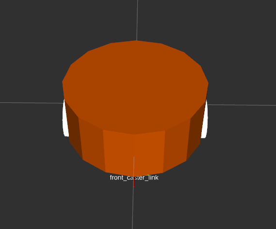
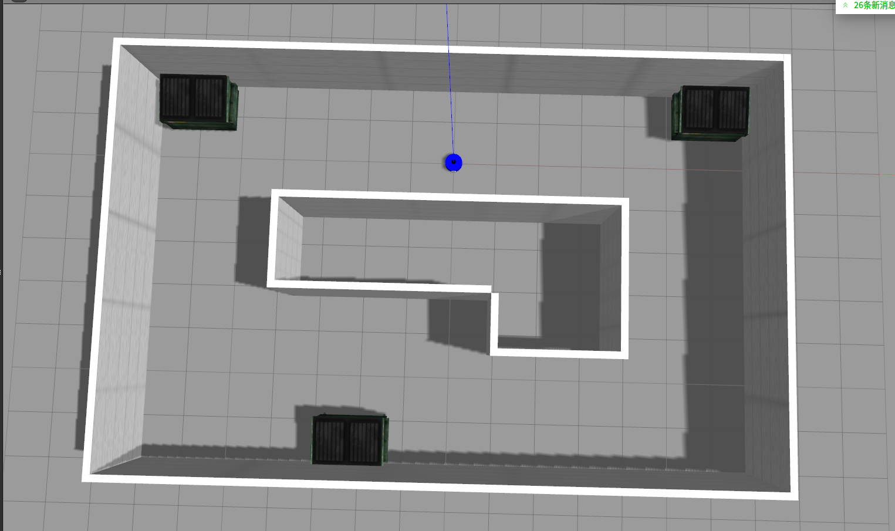
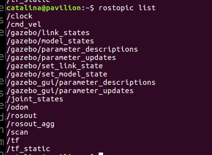
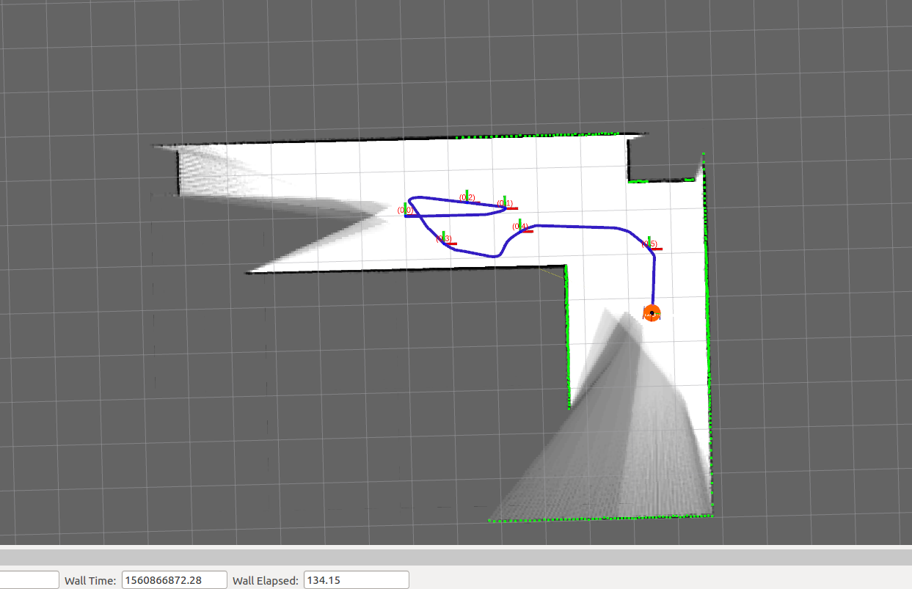
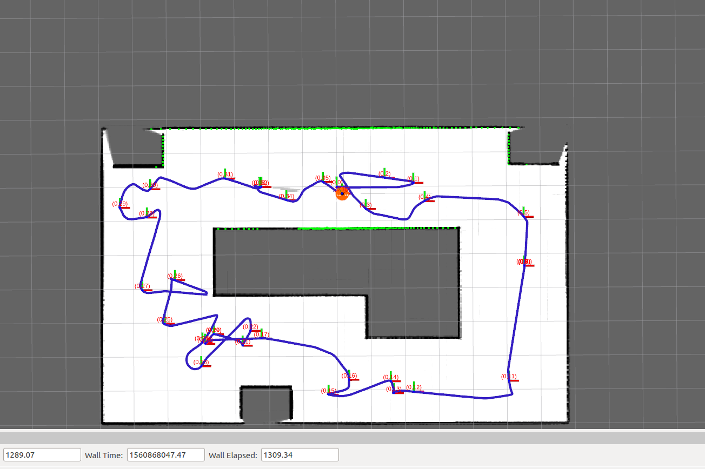
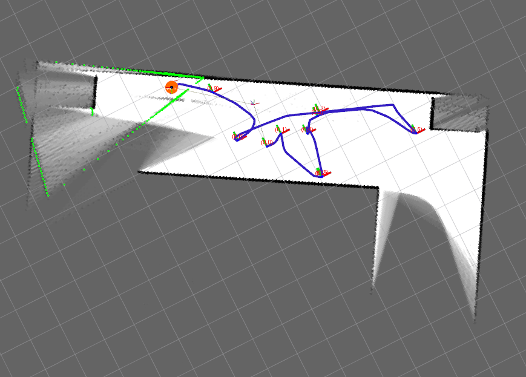
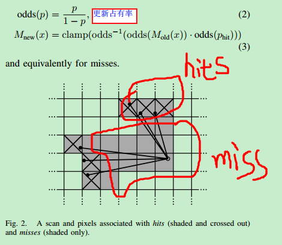
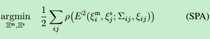

# 项目测试效果分析

## 1、实验情况说明

​	cartographer的设计目的是在计算资源有限的条件下，实时获取相对较高精度的2D地图，考虑到基于模拟策略的粒子滤波方法在较大环境下对内存和计算资源的需求较高，cartographer采用图网络的优化方法。目前cartographer主要基于激光雷达来实现SLAM。

​	我们所有的功能都需要在仿真器中完成，我们需要创建仿真环境，创建搭载深度传感器以及里程计的多功能机器人模型，实现Gazebo中机器人的SLAM并分析实验结果。

### 创建机器人模型

#### 创建机器人urdf模型

URDF是一种使用XML格式描述的机器人模型文件

- Links：坐标系与几何关系
- Joints：Links之间的关系

机器人的3D模型在ROS中是通过URDF文件实现，URDF（Unified Robot Description Format）就是描述机器人硬件尺寸布局的模型语言。它是同ROS通信的渠道，通过机器人的物理尺寸来配置机器人模型，ROS就可以有效的进行自主导航（Navagation）和碰撞检测(collision detect)了。

###### 创建机器人描述功能包

在ROS中，所有的ROS软件（包括我们创建的软件）都被组织成软件包的形式。因此，在工作空间catkin_ws/src/目录下通过catkin_create_pkg来创建硬件描述包：

```
$ catkin_create_pkg autolabor_description urdf
```

功能包中包含urdf，meshes,launch和config四个文件夹

urdf:用于存放机器人模型的urdf或xacro文件

meshes:用于放置URDF中引用的模型渲染文件

launch：用于保存相关启动文件

config:用于保存rviz相关文件

因为建立的是一个非常简单的机器人，所以我们尽量使用简单的元素：使用长方体代替车模，使用圆柱代替车轮

###### 创建URDF相关模型

 我们设计的机器人的底盘模型有7个link和6个joint。7个link包括1个机器人底板，2个电机，2个驱动轮和2个万向轮；6个joint负责将驱动轮、万向轮、电机安装到底板上，并设置相应的连接方式。以下是模型文件的具体内容。

```xml
<?xml version="1.0" ?>
<robot name="mbot">
    <link name="base_link">
        <visual>
            <origin xyz="0 0 0" rpy="0 0 0"/>
            <geometry>
                <cylinder length="0.16" radius="0.20"/>
            </geometry>
            <material name="yellow">
                <color rgba="1 0.4 0 1"/>
            </material>
        </visual>
    </link>
    <joint name="left_wheel_joint" type="continuous">
        <origin xyz="0 0.19 -0.05" rpy="0 0 0"/>
        <parent link="base_link"/>
        <child link="left_wheel_link"/>
        <axis xyz="0 1 0"/>
    </joint>

    <link name="left_wheel_link">
        <visual>
            <origin xyz="0 0 0" rpy="1.5707 0 0" />
            <geometry>
                <cylinder radius="0.06" length = "0.025"/>
            </geometry>
            <material name="white">
                <color rgba="1 1 1 0.9"/>
            </material>
        </visual>
    </link>

    <joint name="right_wheel_joint" type="continuous">
        <origin xyz="0 -0.19 -0.05" rpy="0 0 0"/>
        <parent link="base_link"/>
        <child link="right_wheel_link"/>
        <axis xyz="0 1 0"/>
    </joint>

    <link name="right_wheel_link">
        <visual>
            <origin xyz="0 0 0" rpy="1.5707 0 0" />
            <geometry>
                <cylinder radius="0.06" length = "0.025"/>
            </geometry>
            <material name="white">
                <color rgba="1 1 1 0.9"/>
            </material>
        </visual>
    </link>

    <joint name="front_caster_joint" type="continuous">
        <origin xyz="0.18 0 -0.095" rpy="0 0 0"/>
        <parent link="base_link"/>
        <child link="front_caster_link"/>
        <axis xyz="0 1 0"/>
    </joint>

    <link name="front_caster_link">
        <visual>
            <origin xyz="0 0 0" rpy="0 0 0"/>
            <geometry>
                <sphere radius="0.015" />
            </geometry>
            <material name="black">
                <color rgba="0 0 0 0.95"/>
            </material>
        </visual>
    </link>

    <joint name="back_caster_joint" type="continuous">
        <origin xyz="-0.18 0 -0.095" rpy="0 0 0"/>
        <parent link="base_link"/>
        <child link="back_caster_link"/>
        <axis xyz="0 1 0"/>
    </joint>

    <link name="back_caster_link">
        <visual>
            <origin xyz="0 0 0" rpy="0 0 0"/>
            <geometry>
                <sphere radius="0.015" />
            </geometry>
            <material name="black">
                <color rgba="0 0 0 0.95"/>
            </material>
        </visual>
    </link>

</robot>
```
###### 解析urdf模型

针对上面创建的urdf模型，需要对其关键部分进行解析。

###### 改进urdf模型

我们需要对其添加物理属性和碰撞属性，在base_link中加入<inertial>和<collision>标签。分别描述机器人的物理属性和碰撞属性，其中惯性参数的设置主要包含质量和惯性矩阵。如果是规则物体，可以通过尺寸质量计算得到惯性矩阵。

#### 创建launch命令文件

launch文件的作用是:同时启动多个节点,使用roslaunch命令运行.launch文件中指定的节点。在launch文件夹中创建文件display.launch，并编辑，代码如下：

```xml
<launch>
	<param name="robot_description" textfile="$(find mbot_description)/urdf/urdf/mbot_base.urdf" />
<!-- 设置GUI参数，显示关节控制插件 -->
<param name="use_gui" value="true"/>

<!-- 运行joint_state_publisher节点，发布机器人的关节状态  -->
<node name="joint_state_publisher" pkg="joint_state_publisher" type="joint_state_publisher" />

<!-- 运行robot_state_publisher节点，发布tf  -->
<node name="robot_state_publisher" pkg="robot_state_publisher" type="state_publisher" />
<!-- 运行rviz可视化界面 -->
<node name="rviz" pkg="rviz" type="rviz" args="-d $(find mbot_description)/config/mbot_urdf.rviz" required="true" />
</launch>
```
启动launch文件我们的机器人底盘模型效果如图



并在rviz中显示该模型，并检查是否符合设计目标。运行成功后会出现一个名为”joint_state_publisher“的UI。这是因为我们在启动文件中启动了join_state_publisher节点，该节点可以发布每个joint的状态，并且可以通过UI对joint进行控制。launch文件中还启动了一个名为robot_state_publisher的节点，其功能是将机器人各个link、joint之间的关系，通过Tf的方式整理成三维姿态信息发布出去，在Rviz中可以选择添加TF插件来显示各部分的坐标系。

#### 使用xacro优化urdf

###### URDF建模存在的问题

- 模型冗长，重复内容过多
- 参数修改麻烦，不便于二次开发
- 没有参数自动计算功能

现在的机器人模型，我们创建了一个十分冗长的模型文件，其中有很多除了参数，几乎都是重复的内容，ros中提供了一种精简化，可复用，模块化的描述形式--xacro，它具备以下几点突出优势

- 精简模型代码：xacro是一个精简版的urdf模型，在xacro文件中。可以通过创建宏定义的方式定义常量或者复用代码，不仅可以减小代码量，而且可以让模型代码更加模块化。更具有可读性。
- 提供可编程接口，xacro的语法支持一些可编程接口，如常量、变量、数学公式、条件语句等，可以让建模过程更加智能有效。

xacro是urdf的升级版，后缀名由urdf变成.xacro，而且在模型中需要加入xacro的声明。

直接在文件中调用xacro解析器可以自动将xacro转化成urdf文件，在rviz中显示出来。

前面也提到了, XACRO文件和URDF实质上是等价的. XACRO格式提供了一些更高级的方式来组织编辑机器人描述. 主要提供了三种方式来使得整个描述文件变得简单. 借用在教程中一句话来形容xacro的优势: “Fortunately, you can use the xacro package to make your life simpler”.

###### 使用常量定义

在之前URDF模型中有很多尺寸、坐标等常量的使用，但这些常量分布在整个文件中，可读性很差，后期修改也十分困难，xacro提供了一种常量的属性定义方式。

```

```


#### 添加传感器

###### 添加深度相机

​	首先尝试创建一个摄像头模型，依照真实摄像探头，我们画了一个长方形，以此代表摄像头模型，对应的模型文件是camera.xacro，如下

```xml
<?xml version="1.0"?>
<robot xmlns:xacro="http://www.ros.org/wiki/xacro" name="camera">

    <xacro:macro name="usb_camera" params="prefix:=camera">
        <link name="${prefix}_link">
            <visual>
                <origin xyz=" 0 0 0 " rpy="0 0 0" />
                <geometry>
                    <box size="0.01 0.04 0.04" />
                </geometry>
                <material name="black"/>
            </visual>
        </link>
    </xacro:macro>

</robot>
```

以上代码使用一个名为usb_camera的宏来描述摄像头，输入参数是摄像头的名称，宏中包含了摄像头长方体link的参数。然后还需要创建一个顶层xacro文件，把机器人和摄像头模块拼装在一起，顶层xacro文件的内容如下。

```xml
<?xml version="1.0"?>
<robot name="arm" xmlns:xacro="http://www.ros.org/wiki/xacro">

    <xacro:include filename="$(find mbot_description)/urdf/xacro/mbot_base.xacro" />
    <xacro:include filename="$(find mbot_description)/urdf/xacro/sensors/camera.xacro" />

    <xacro:property name="camera_offset_x" value="0.17" />
    <xacro:property name="camera_offset_y" value="0" />
    <xacro:property name="camera_offset_z" value="0.10" />

    <mbot_base/>

    <!-- Camera -->
    <joint name="camera_joint" type="fixed">
        <origin xyz="${camera_offset_x} ${camera_offset_y} ${camera_offset_z}" rpy="0 0 0" />
        <parent link="base_link"/>
        <child link="camera_link"/>
    </joint>

    <xacro:usb_camera prefix="camera"/>

</robot>
```

在rviz中可查看机器人模型

###### 添加激光雷达

使用类似的方式可以为机器人添加一个激光雷达模型,这里概述。未来实现机器人仿真，需要想办法控制机器人在虚拟环境中的运动，另外如果仿真中的传感器可以像真实设备一样获取环境中的信息就更好了。

### Gazebo物理仿真

#### 添加gazebo属性

使用xacro设计的机器人urdf模型已经可以描述机器人外观特征和物理特性，虽然已经具备在Gazebo中仿真的基本条件，但是由于没有在模型中加入Gazebo相关的属性，还是无法让模型在Gazebo仿真环境中动起来。为了可以开始仿真，首先我们需要确保每个link的<inertia>元素进行合理的配置，然后需要为每个必要的<link>、<joint>、<robot>设置<gazebo>标签。gazebo标签是urdf模型中描述gazebo仿真时需要的扩展属性。

添加传动装置

添加gazebo控制器插件

在gazebo中显示机器人模型

控制机器人在gazebo中运动

#### 激光雷达仿真

在slam和导航机器人应用中，为了获取更精确的环境信息，往往使用激光雷达作为主要传感器。我们需要在gazebo中为仿真机器人装载一款激光雷达。

##### 为rplidar模型添加gazebo插件

我们使用的激光雷达是raplidar，在rplidar模型文件中添加<gazebo>标签

```xml
<?xml version="1.0"?>
<robot xmlns:xacro="http://www.ros.org/wiki/xacro" name="laser">

    <xacro:macro name="rplidar" params="prefix:=laser">
        <!-- Create laser reference frame -->
        <link name="${prefix}_link">
            <inertial>
                <mass value="0.1" />
                <origin xyz="0 0 0" />
                <inertia ixx="0.01" ixy="0.0" ixz="0.0"
                         iyy="0.01" iyz="0.0"
                         izz="0.01" />
            </inertial>

            <visual>
                <origin xyz=" 0 0 0 " rpy="0 0 0" />
                <geometry>
                    <cylinder length="0.05" radius="0.05"/>
                </geometry>
                <material name="black"/>
            </visual>

            <collision>
                <origin xyz="0.0 0.0 0.0" rpy="0 0 0" />
                <geometry>
                    <cylinder length="0.06" radius="0.05"/>
                </geometry>
            </collision>
        </link>
        <gazebo reference="${prefix}_link">
            <material>Gazebo/Black</material>
        </gazebo>

        <gazebo reference="${prefix}_link">
            <sensor type="ray" name="rplidar">
                <pose>0 0 0 0 0 0</pose>
                <visualize>false</visualize>
                <update_rate>5.5</update_rate>
                <ray>
                    <scan>
                      <horizontal>
                        <samples>360</samples>
                        <resolution>1</resolution>
                        <min_angle>-3</min_angle>
                        <max_angle>3</max_angle>
                      </horizontal>
                    </scan>
                    <range>
                      <min>0.10</min>
                      <max>6.0</max>
                      <resolution>0.01</resolution>
                    </range>
                    <noise>
                      <type>gaussian</type>
                      <mean>0.0</mean>
                      <stddev>0.01</stddev>
                    </noise>
                </ray>
                <plugin name="gazebo_rplidar" filename="libgazebo_ros_laser.so">
                    <topicName>/scan</topicName>
                    <frameName>laser_link</frameName>
                </plugin>
            </sensor>
        </gazebo>

    </xacro:macro>
</robot>
```

激光雷达的传感器类型是ray，rplidar的相关参数可以在产品手册中找到。为了获取尽量贴近真实的仿真效果，需要根据实际参数配置<ray>中的雷达参数：360度检测范围、单圈360个采样点，5.5hz采样频率，最远6m检测范围等。最后用<plugs>标签加载激光雷达的libgazebo_ros_laser.so，所发布的激光雷达的话题是“/scan”


#### 运行仿真环境

启动仿真环境并加载机器人

查看当前系统中的话题列表，确保laser插件已经启动成功

使用命令可查看rplidar的激光数据，并在rviz中显示出来。

### SLAM建图

​	slam问题可以描述为：机器人在未知环境中从一个未知未知开始移动，移动过程中根据位置估计和地图进行自身定位，同时建造增量式地图，实现机器人的自主定位和导航。要完成机器人的Slam，首先要具备感知周围环境的能力，因为这是用于探测障碍物的关键数据。用于获取深度信息的传感器这里我们主要用激光雷达。

#### 准备工作

##### 传感器信息

###### 深度信息

​	针对激光雷达，ros在sensor_msgs包中定义了专用的数据结构-LaserScan，用于存储激光信息。Laserscan消息具体的定义如下：

###### 里程计信息

​	里程计根据传感器获取的数据来估计机器人随实践发生的位置变化。在机器人平台中，较为常见的里程计是编码器，例如机器人驱动轮配备的旋转编码器。当机器人移动时，借助旋转编码器可以测量轮子旋转的圈数，如果知道轮子的周长，便可以计算出机器人单位时间内的速度以及一段时间内的移动距离。里程计根据速度对实践的积分球的位置这种方法对误差十分敏感，所以采取如精确的数据采集，设备标定，数据滤波等措施十分必要的。

​	导航功能包要求机器人能够发布里程计nav_msgs/Odemetry消息。nav_msgs/Odemetry消息包含机器人在自由空间中的位置和速度估算值。

- pose :机器人当前位置坐标，包括机器人的x,y,z三轴位置与方向参数，以及用于校正误差的协方差矩阵。
- twist:机器人当前的运动状态，包括x,y,z三轴的线速度与角速度，以及用于校正误差的协方差矩阵

上述数据结构中，除了数据与位置的关键信息外，还包含用于滤波算法的协方差矩阵。在精度要求不高的机器人系统中可以使用默认的协方差矩阵；而在竞答要求高的系统中，需要先对机器人精确建模，再通过仿真、实验等方法确定该矩阵的具体数值。

#### 仿真平台

##### 创建仿真环境

使用Gazebo Building Editor工具绘制一个类似于走廊的仿真环境，然后在走廊中加入一些障碍物。如下图所示。



##### 加载机器人

接下来将搭载激光雷达的机器人模型放置到仿真环境中，启动launch文件，代码如下

```xml
<launch>
    <!-- 设置launch文件的参数 -->
    <arg name="world_name" value="$(find mbot_gazebo)/worlds/cloister.world"/>
    <arg name="paused" default="false"/>
    <arg name="use_sim_time" default="true"/>
    <arg name="gui" default="true"/>
    <arg name="headless" default="false"/>
    <arg name="debug" default="false"/>

    <!-- 运行gazebo仿真环境 -->
    <include file="$(find gazebo_ros)/launch/empty_world.launch">
        <arg name="world_name" value="$(arg world_name)" />
        <arg name="debug" value="$(arg debug)" />
        <arg name="gui" value="$(arg gui)" />
        <arg name="paused" value="$(arg paused)"/>
        <arg name="use_sim_time" value="$(arg use_sim_time)"/>
        <arg name="headless" value="$(arg headless)"/>
    </include>

    <!-- 加载机器人模型描述参数 -->
    <param name="robot_description" command="$(find xacro)/xacro --inorder '$(find mbot_description)/urdf/xacro/gazebo/mbot_with_laser_gazebo.xacro'" /> 

    <!-- 运行joint_state_publisher节点，发布机器人的关节状态  -->
    <node name="joint_state_publisher" pkg="joint_state_publisher" type="joint_state_publisher" ></node> 

    <!-- 运行robot_state_publisher节点，发布tf  -->
    <node name="robot_state_publisher" pkg="robot_state_publisher" type="robot_state_publisher"  output="screen" >
        <param name="publish_frequency" type="double" value="50.0" />
    </node>

    <!-- 在gazebo中加载机器人模型-->
    <node name="urdf_spawner" pkg="gazebo_ros" type="spawn_model" respawn="false" output="screen"
          args="-urdf -model mbot -param robot_description"/> 

</launch>
```

查看当前系统中的话题列表，可以看到里程计信息”/odom“和深度信息”/scan“都已经顺利发布



smartcar里程计信息在驱动节点mbot_bringup/src/mbot.cpp中实现，计算里程信息代码如下

```c++
  // 积分计算里程计信息
    vx_  = (vel_right.odoemtry_float + vel_left.odoemtry_float) / 2 / 1000;
    vth_ = (vel_right.odoemtry_float - vel_left.odoemtry_float) / ROBOT_LENGTH;
    
    curr_time = ros::Time::now();

    double dt = (curr_time - last_time_).toSec();
    double delta_x = (vx_ * cos(th_) - vy_ * sin(th_)) * dt;
    double delta_y = (vx_ * sin(th_) + vy_ * cos(th_)) * dt;
    double delta_th = vth_ * dt;

    x_ += delta_x;
    y_ += delta_y;
    th_ += delta_th;
    last_time_ = curr_time;               

```

首先计算本周起运动时间长度，根据运动的角度和距离，计算机器人在x轴，在y轴的位置变化和角度变化。将计算得到的信息发布在主循环里面。

```c++
  // 发布里程计消息
    nav_msgs::Odometry msgl;
    msgl.header.stamp = current_time_;
    msgl.header.frame_id = "odom";

    msgl.pose.pose.position.x = x_;
    msgl.pose.pose.position.y = y_;
    msgl.pose.pose.position.z = 0.0;
    msgl.pose.pose.orientation = odom_quat;
    msgl.pose.covariance = odom_pose_covariance;

    msgl.child_frame_id = "base_footprint";
    msgl.twist.twist.linear.x = vx_;
    msgl.twist.twist.linear.y = vy_;
    msgl.twist.twist.angular.z = vth_;
    msgl.twist.covariance = odom_twist_covariance;
  
    pub_.publish(msgl);
```

#### cartographer编译运行

cartographer功能包已经与ROS集成，但还没有提供二进制安装包，所以需要采用源码编译的方式进行安装。为了不与已有的功能包冲突，最好为cartographer专门创建一个工作空间，使用以下步骤下载源码并完成编译。

```bash
# 编译命令
catkin_make_isolated --install --use-ninja
source install_isolated/setup.bash
```

我们需要将cartographer移植到自己的机器人上。cartographer提供了基于Revo LDS的demo，与我们使用的rplidar最相近，可以参考进行实现。

###### cartographer_demo.launch

​	cartographer的核心是cartographer_node节点，可以参考cartographer功能包中的demo_revo_lds.launch。在cartographer_ros功能包的launch文件夹下复制demo_revo_lds.launch重命名并修改以下代码。

```xml
<launch>  
  <param name="/use_sim_time" value="true" />  
  <node name="cartographer_node" pkg="cartographer_ros"  
        type="cartographer_node" args="  
            -configuration_directory $(find cartographer_ros)/configuration_files  
            -configuration_basename rplidar.lua"  
        output="screen">  
    <remap from="scan" to="scan" />  
  </node>  
  <node name="rviz" pkg="rviz" type="rviz" required="true"  
        args="-d $(find cartographer_ros)/configuration_files/demo_2d.rviz" />  
</launch>
```

此launch文件主要包含两部分的工作：一试运行cartographer节点，二是启动rviz可视化界面。当运行cartographer_node节点时，需要用一个由Lua编写的代码文件rplidar.lua，该文件的主要作用是进行参数配置。

rplidar.lua文件主要需要设置坐标系与机器人匹配

```lua
include "map_builder.lua"
include "trajectory_builder.lua"

options = {
    map_builder = MAP_BUILDER,
    trajectory_builder = TRAJECTORY_BUILDER,
    map_frame = "map",
    tracking_frame = "base_link",
    published_frame = "odom",
    odom_frame = "odom",
    provide_odom_frame = false,
    use_odometry = true,
    num_laser_scans = 1,
    num_multi_echo_laser_scans = 0,
    num_subdivisions_per_laser_scan = 1,
    num_point_clouds = 0,
    lookup_transform_timeout_sec = 0.2,
    submap_publish_period_sec = 0.3,
    pose_publish_period_sec = 5e-3,
    trajectory_publish_period_sec = 30e-3,
}

MAP_BUILDER.use_trajectory_builder_2d = true

TRAJECTORY_BUILDER_2D.submaps.num_range_data = 35
TRAJECTORY_BUILDER_2D.min_range = 0.3
TRAJECTORY_BUILDER_2D.max_range = 8.
TRAJECTORY_BUILDER_2D.missing_data_ray_length = 1.
TRAJECTORY_BUILDER_2D.use_imu_data = false
TRAJECTORY_BUILDER_2D.use_online_correlative_scan_matching = true
TRAJECTORY_BUILDER_2D.real_time_correlative_scan_matcher.linear_search_window = 0.1
TRAJECTORY_BUILDER_2D.real_time_correlative_scan_matcher.translation_delta_cost_weight = 10.
TRAJECTORY_BUILDER_2D.real_time_correlative_scan_matcher.rotation_delta_cost_weight = 1e-1

SPARSE_POSE_GRAPH.optimization_problem.huber_scale = 1e2
SPARSE_POSE_GRAPH.optimize_every_n_scans = 35
SPARSE_POSE_GRAPH.constraint_builder.min_score = 0.65

return options
```

通过Lua脚本配置参数的方法，每次修改参数后需要重新编译，否则参数无法生效。

#### 在Gazebo中仿真SLAM

启动仿环境，加载机器人，启动cartographer_ros节点以及机器人键盘控制节点

```
roslaunch cartographer_ros cartographer_demo_rplidar.launch 
roslaunch mbot_teleop mbot_teleop.launch 
roslaunch mbot_gazebo mbot_laser_nav_gazebo.launch 
```

在控制机器人移动建图的过程中，地图会已一种渐变的形式由浅入深出现，随着机器人的移动，建立的地图会完全呈现为白色，如下图。



地图中的蓝色轨迹是机器人移动的路线，在机器人绕环境运动一周之后还有部分地图完全没有变成白色，可以控制机器人到这些位置附近，继续完善地图。

建图完成后，由于cartographer创建的地图与gmapping、hector_slam生成的地图格式不同，需要使用以下命令保存为ROS格式的地图

```
rosservice call /finish_trajectory  "map"
```

使用激光雷达进行cartographer SLAM建图的最终效果如下，可以看出建图效果还是相当理想



但也并非十全十美，在有回环时候，已经出现了一定程度的漂移。



## 2、原理及效果分析

cartographer是Google的实时室内建图项目，传感器安装在背包上面，可以生成分辨率为5cm的2D格网地图。

获得的每一帧laser scan数据，利用scan match在最佳估计位置处插入子图（submap）中，且scan matching只跟当前submap有关。在生成一个submap后，会进行一次局部的回环（loop close），利用分支定位和预先计算的网格，所有submap完成后，会进行全局的回环。

### 2D slam

submap的构造是一个重复迭代配准scan和submap的过程。利用配准估算出pose对scan进行刚体变换，插入到submap中。

连续的scan用来构造submap，这里submap以概率格网的形式表现。每一个scan，在插入格网（submap）时，每一个grid有hits和miss两种情况。离scan终点最近的grid为hits，在scan原点和终点之间相交的grid为miss。之前未观察的grid分配一个概率，已观察的grid进行概率更新。



在scan matching的时候把求pose的问题转换为一个求解非线性最小二乘问题，利用Ceres解决这个问题。因为最小二乘问题是一个局部最优问题，故一个好的初值（pose初值）对求解有很大影响。因此IMU能被用来提供pose初值的旋转变量。在缺乏IMU的时候，可以用提高scan match频率或匹配精度。

### 回环检测

利用SPA方法优化scan和submap的pose。存储插入scan位置处对应的pose用来做回环检测。此外，当submap不在变化时，对应pose的scan和submap也被用来做回环。scan match中找到的good match其对应的pose将被用来做优化问题。

回环优化问题构造成非线性最小二乘问题，来求解。



公式中分别为submap的pose，scan的pose，对应submap和scan的pose的相关性，及相关协方差矩阵。

在执行全局优化时，Ceres尝试改善IMU和测距传感器之间的姿势。选择良好的采集具有大量的闭环约束（例如，如果您的机器人沿直线然后返回）可以提高这些校正的质量并成为姿势校正的可靠来源。然后，您可以使用制图师作为校准过程的一部分，以提高机器人外部校准的质量。