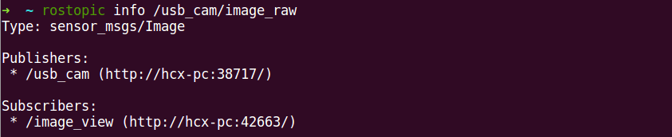
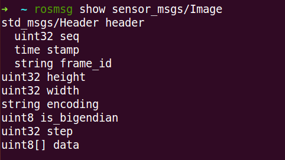
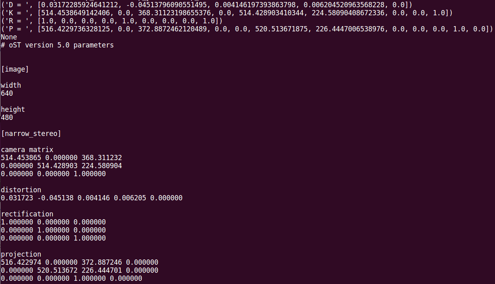
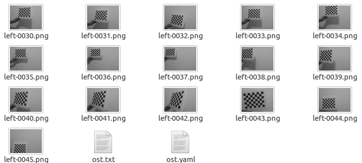

# ROS标定


**显示图像类型**

```
roslaunch usb_cam usb_cam_test.launch
rostopic  info  /usb_cam/image_raw
```



**查看图像消息**

rosmsg   show  sensor_msgs/Image




catkin_make编译robot_vision

**启动摄像头**

```
roslaunch robot_vision usb_cam.launch
```

**启动标定包**

```
rosrun camera_calibraion  carmeracalibrator.py  —size 8X6  —squre 0.24 image:=/usb_cam/image_raw carmera:=/usb_cam 
```

size:标定棋盘格内部角点个数，这里使用的棋盘一共有六行，每行8个内部角点

square：这个参数对应每个棋盘格的边长，单位是米

image和carmera:摄像头发布的图像话题


**终端中的标定结果**



**标定结果**

