# 使用Autoware实践激光雷达与摄像机组合标定

​	单目相机分辨率高，我们可以使用各种深度学习算法完成对目标检测，但是缺乏深度，坐标等信息。激光雷达能够获得目标相当精确的三维坐标信息，但是分辨率低，目前主流的为64线和32线，稀疏的电云数据为模式识别带来了困难。一种简单的思路是**融合相机和激光雷达对目标障碍物完成检测，在图像层面使用深度学习方法将目标检测识别，然后将目标从二维图像映射到三维电云，从而画出目标在三维空间的位置以及边界（3维的bounding box）**。实现这一映射的前提是完成Camera到激光雷达的组合标定。本文即讲解如何使用开源无人驾驶软件Autoware实践组合标定。

1. 标定准备
  在进行标定之前，需要有如下硬件准备： 
* 标定板:规格为 A0 尺寸的硬纸板(841 ×× 1189mm) 9行7列，注意一定要是硬纸板，如下图所示:

  

已驱动的摄像机：推荐FLIR的Grasshopper3 相机，ROS下驱动简单，帧率高，可是距离远，全局快门。如下图所示：

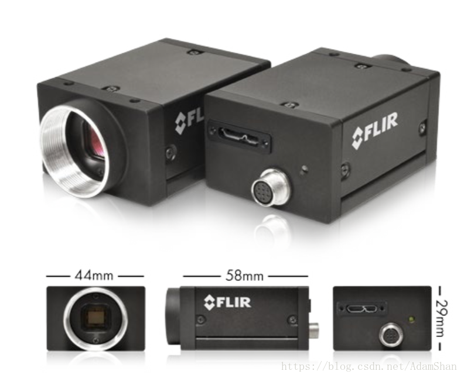

已驱动的激光雷达: 推荐使用Velodyne VLP-32C或者HDL-64

确定举标定板人的站位及动作：标定板在摄像头下一般有6个站位，每个位置做相同的一组5个动作。5个动作分别为:**正向; 下俯; 上仰; 左偏; 右偏**。如下图所示：

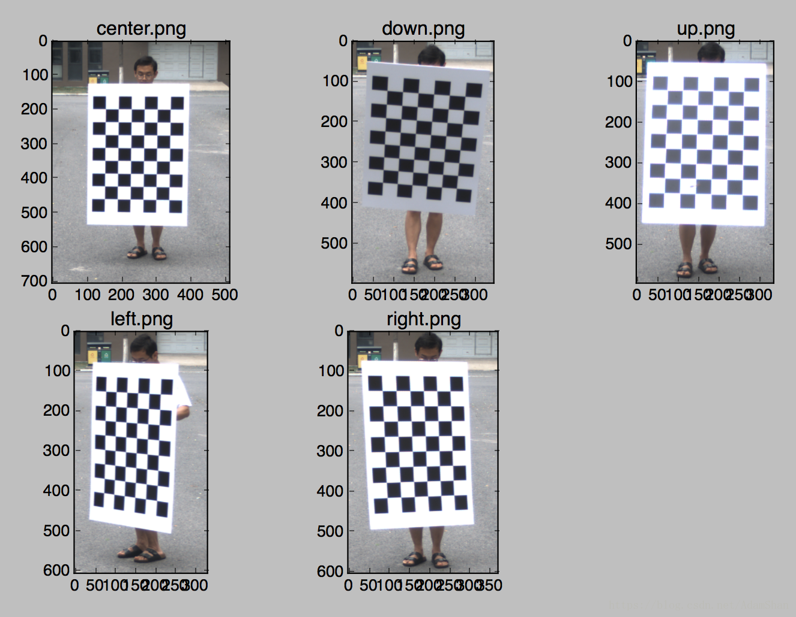

6个站位分别为:

1). 近距离镜头左边(近距离一般为5m)

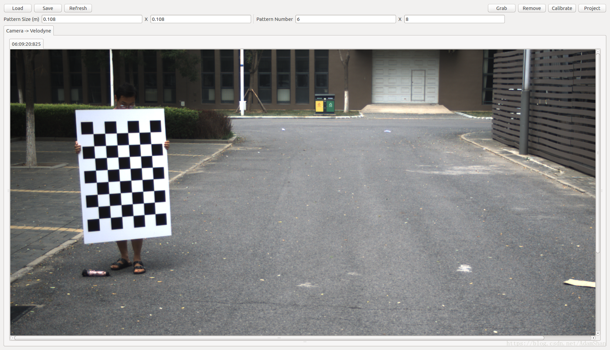

2). 近距离镜头中间

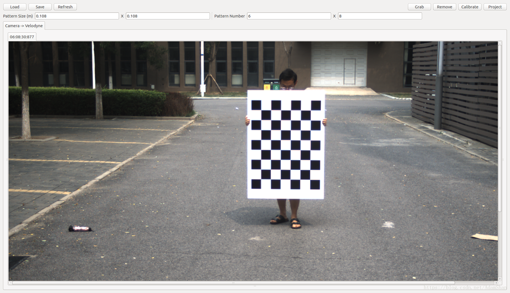

3). 近距离镜头右边

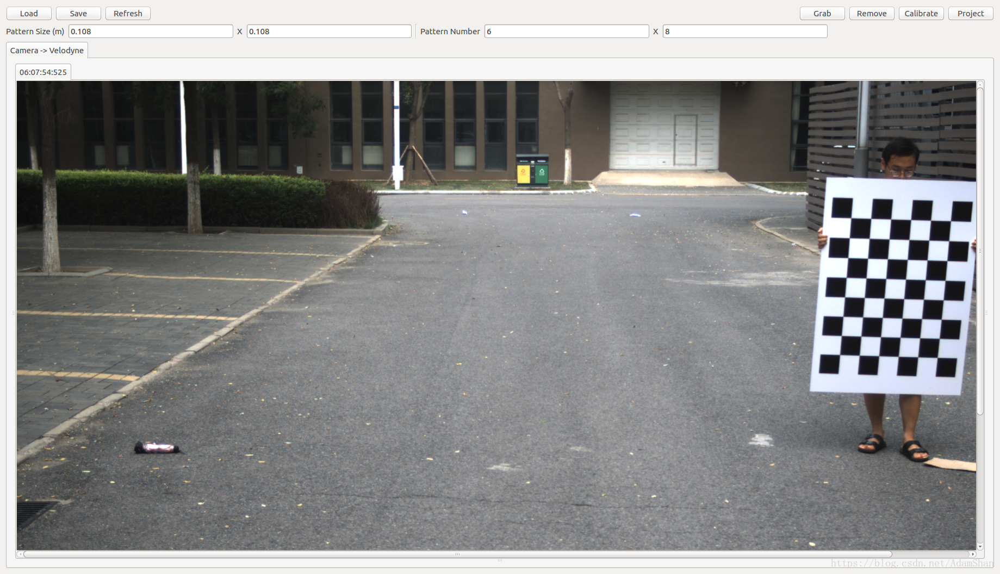

4). 远距离镜头左边(远距离依照摄像机和激光雷达真实情况而定)

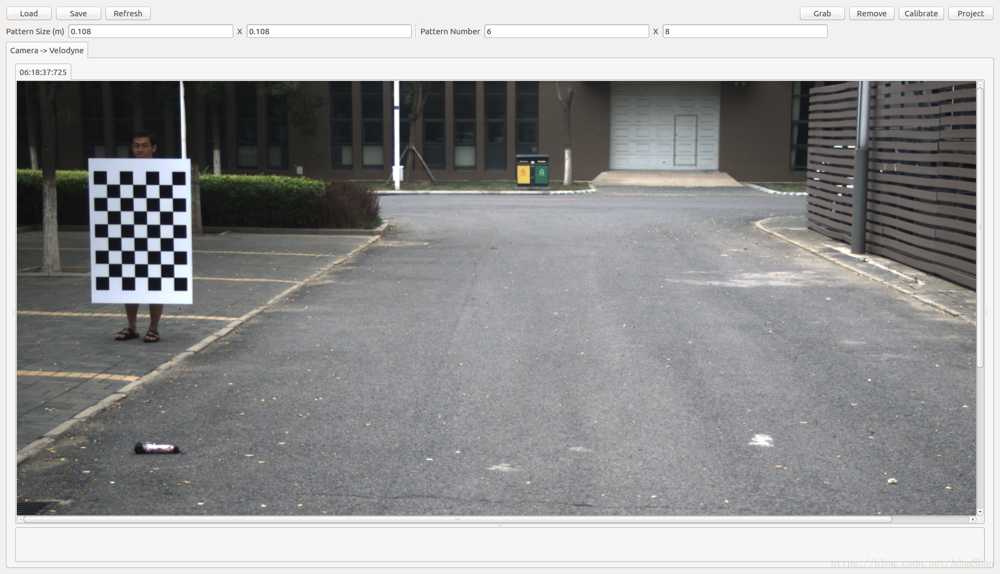

5). 远距离镜头中间

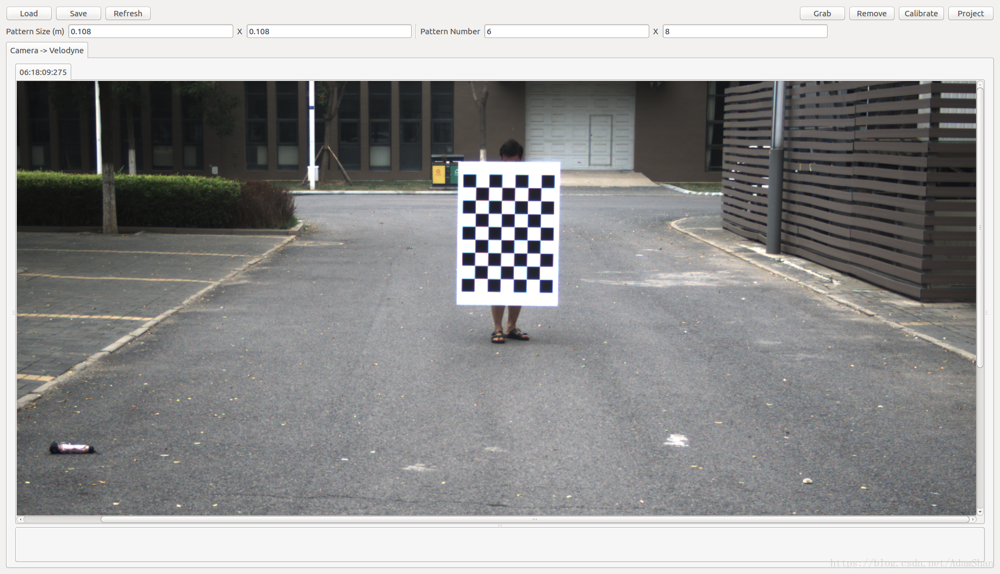

6). 远距离镜头右边 

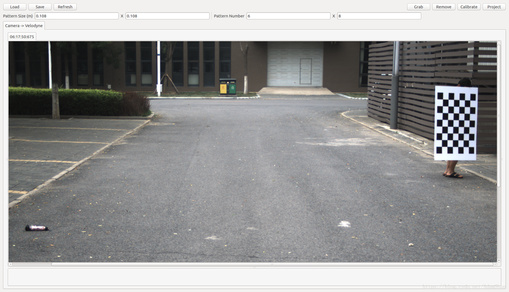


以上位置和动作的顺序均不固定，可自行决定

#### 2、录制标定包

​	1、启动Autoware，打开ROSBAG，Autoware下用来录包的一个工具
​	2、勾选/image_raw和/velodny_points两个话题
​	3、start启动
​	4、录制，保存

### 3、使用Calibration Tool Kit标定

(1) 加载包， 在终端输入:

```
rosbag play bagName.bag /velodyne_points:=/points_raw
```

加载成功后，立即空格暂停。

(2) 配置Tool Kit:

第一个对话框选取话题/image_raw

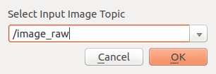

第二个对话框选取camera-velodyne

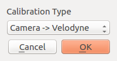

(3) Calibration Tool Kit打开后，参数设置:

> Pattern Size(m)为0。108和0。108;
> Pattern Number为6和8

如果使用的标定板不是上文中的规格，请自行设定参数

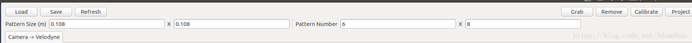

(4) 参数设置之后关闭Calibration Tool Kit，重启加载配置

(5) 加载数据: 
Calibration Tool Kit打开后， 取消暂停继续运行包; 当MainWindow出现画面后，暂停包，调整MainWindow中画面位置

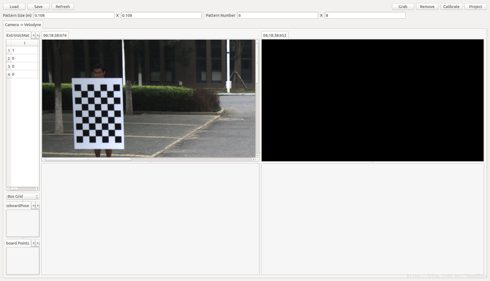

右上角为激光雷达数据， 首先点击图像， 使用键盘上’b’键调浅背景颜色

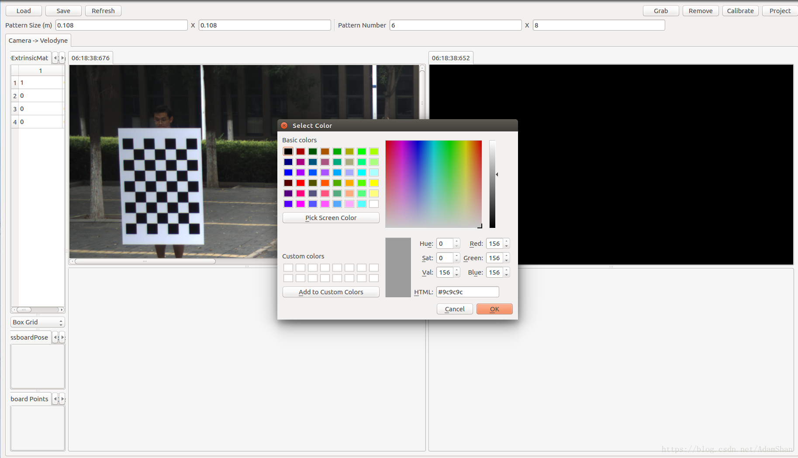

使用键盘上各个功能键调整角度。使得激光雷达图像下可以看到棋盘

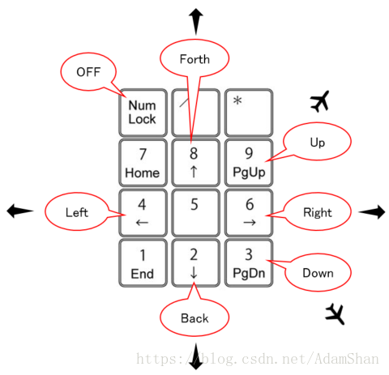

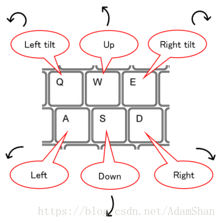


结果如下:

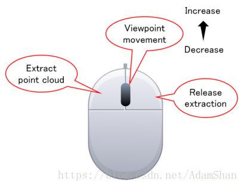

(6) 进行标记:

运行包，当进行到合适位置角度时，暂停包， 点击MainWindow右上角”Grab”，生成下半部分的摄像机和激光雷达信息的两个图像，调整位置


在右下方的图像中找到标定板对应的位置，鼠标左键标记。如果标记有误，鼠标右键取消

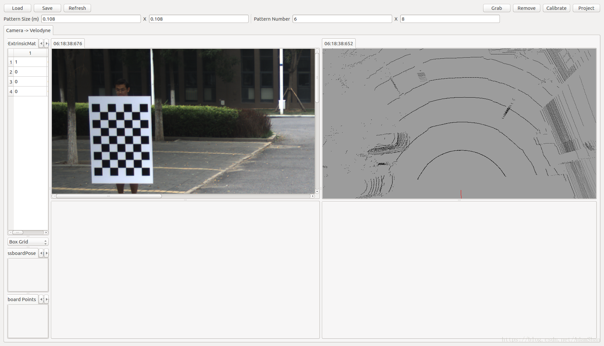

效果如图:

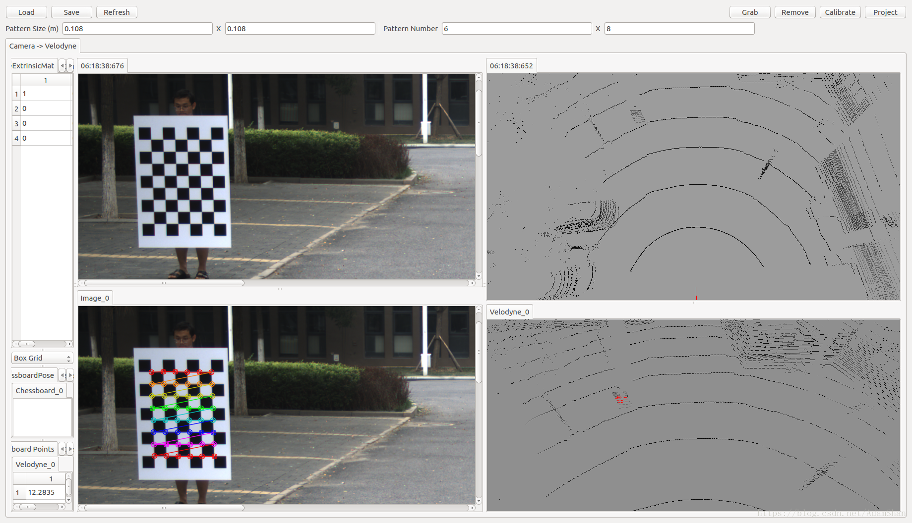

(7) 不断重复(6)内容，直至录像结束

(8) 标定计算

点击MainWindow右上角”Calibrate”进行计算。由于计算量很大，这个过程可能会突然占满所有计算资源，但是时间很短。

(9) 验证标定

点击MainWindow右上角”Project”进行验证， 左下方图像中会出现根据计算结果和激光雷达数据生成的图像对应位置，以红色散点表示。如果散点分布在标定板上，说明标定正确；如果散点不在标定板上，则对右下方激光图像重新点选。

正确情况

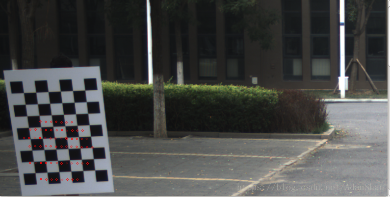

错误情况

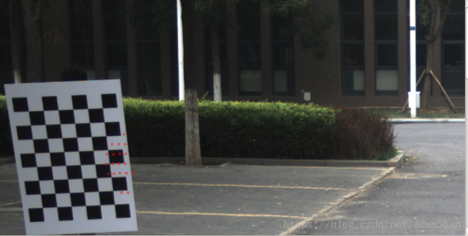

(10) 如果有需要更新的标记，重新点选后，重复以上内容，直至验证通过

(11) 保存结果:

点击MainWindow左上方的”Save”，将结果保存到合适位置。对于下面的两个弹窗，都选择”NO”。

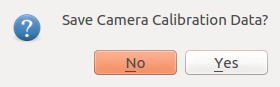

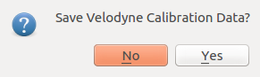

到这里，我们的标定就做好啦♪(^∇^*)

4.标定结果
我们使用Autoware自带的Calibration Publisher和Point Image节点获得点云-图像融合的point-image，在Autoware/Sensing/中打开Calibration Publisher，并将保存好的内外参文件读取进来，打开Autoware/Sensing下的Point Image节点，在Rviz中，Panels/Add New Panel内添加ImageViewerPlugin，填写Image Topic，本例为/image_raw，Point Topic，本例为/point_image，得到如下融合图：

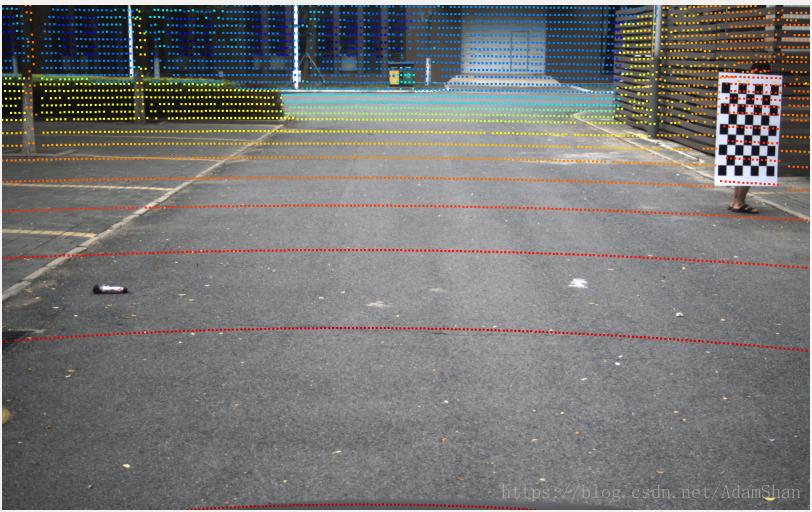

我们加上定位和地图，以及YOLO检测，vision_klt_track，range_fusion，obj_reproj等节点，并在Rviz中添加行人的3维Bounding Box，即可得到检测结果：

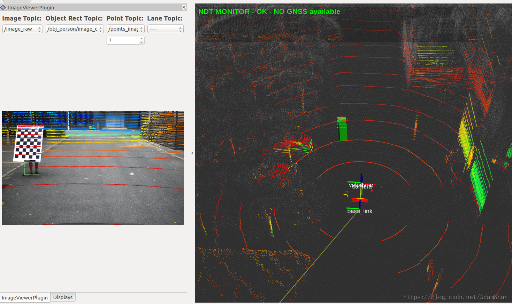

查看对应的camera到velodyne的TF可视化结果如下：

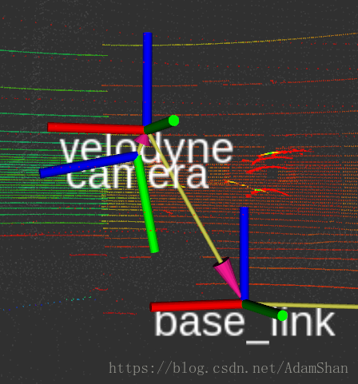